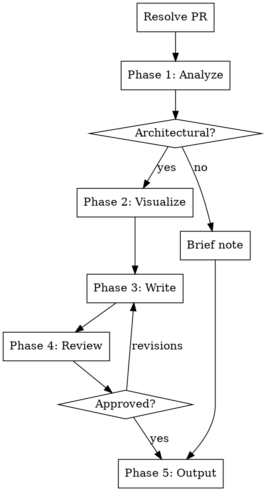

# Architecture Impact Analysis

Analyze a PR's architectural impact. Produces a decision-maker-friendly document with visual before/after diagrams, business impact framing, and honest risk assessment.

## Audience and Principles

The output targets **decision makers**: engineering leads, PMs, and stakeholders.

**Core principles:**

- **Outcomes over implementation.** Lead with what changes for users, teams, and the roadmap, not what was refactored internally.
- **"So what?" test.** Every section must answer: why should a PM care about this?
- **Progressive disclosure.** TL;DR first. Technical details exist for those who want them, but aren't required to understand the impact.
- **Newspaper test.** If a PM read only the title, would they understand why it matters? "Enable independent deployments per framework" passes. "Extract fetch handler into core module" fails.
- **One diagram = one question.** Write the question as the diagram title. If it answers multiple questions, split it.
- **Honest tradeoffs.** PMs respect acknowledged risks far more than false reassurance. Always present what was rejected and why.

## Input

This skill accepts PRs only.

1. Matches GitHub URL or `#\d+` pattern -> **PR**
2. No argument -> ask: "Which PR should I analyze? Provide a PR URL or number."
3. Anything else -> "This skill analyzes PRs only. Provide a PR URL or number."

## Process Flow



**Do NOT skip phases.** If the user bundles multiple answers, accept them and skip ahead.

## Phase 1: Analyze

### Step 1 - Read the PR

Check PR size first with `gh pr view --json files,title,body,comments,reviews`.

Read: title, description, review comments (for decision rationale), commit messages, files changed.

**For the diff:** <20 files: read full diff. 20+ files: selectively read structural changes only (new/deleted/renamed files, changed interfaces, config, dependency files). Skip test files and minor edits.

### Step 2 - Read broader codebase context

Scope to packages the PR touches. Read directory tree (names only), README/architecture docs, dependency files. Goal: understand the architecture before the PR.

### Step 3 - Classify the changes

**Architectural** (changes how components relate to each other):
- New modules, moved boundaries, new layers
- New/removed connections between modules
- Changed data flow paths or API surfaces
- New design patterns introduced or replaced

**Implementation** (changes what happens inside a component):
- Refactored helpers, renamed variables, added error handling, updated dependencies

### Step 4 - "So what?" framing

Before proceeding, complete this sentence:

> "We are doing [technical change] so that [business outcome], which matters because [strategic goal]."

If you cannot complete this sentence, dig deeper into the PR description and review comments until you can. This sentence becomes the spine of the entire analysis.

### Step 5 - Market impact

Go beyond internal engineering impact. Ask:

- **New users:** What user segments were blocked before that are unblocked now? Who couldn't use the product that can now? Be specific about communities, ecosystems, and their approximate size.
- **New partners:** What companies, platforms, or ecosystems can the product now integrate with? What would those partnerships look like (templates, marketplace listings, co-marketing, ecosystem features)?
- **Reduced adoption friction:** How does this change the adoption conversation? What did prospects have to do before vs now? (e.g., "migrate your backend" vs "add 3 lines to your existing server")
- **Competitive positioning:** Does this close a gap with competitors, or open a lead?

Not every PR has market impact. Skip this step for internal-only changes. But for platform expansion, new integrations, or API surface changes, this is often the most valuable part of the analysis.

### Step 6 - Present understanding

Present in business language, not implementation language:

> **What changed:** [one sentence, outcome-focused]
> **Why it matters:** [business impact]
> **What it enables:** [new capabilities]
> **What it costs:** [tradeoffs, risks, migration burden]
> **Who this unlocks:** [new user segments, new partners] (if applicable)
>
> "Does this capture the intent? Anything I'm missing?"

Wait for confirmation before proceeding.

## Phase 2: Visualize

### Diagram selection

Pick the diagram type that matches the question the audience is asking:

| Audience question | Diagram type | Zoom level |
|---|---|---|
| "What does this system connect to?" | System context (C4 Level 1) | Highest |
| "What are the major components?" | Container diagram (C4 Level 2) | High |
| "How does data flow through the system?" | Sequence / flow diagram | Medium |
| "What changed between before and after?" | Before/after comparison | Medium |
| "What's the blast radius of this change?" | Impact radius diagram | Medium |
| "What's the migration timeline?" | Phase / timeline diagram | High |

For most PRs, generate 2-3 diagrams: a **before/after comparison** (always) and one of the others based on what best communicates the change.

For **customer-facing** output, prefer:
- **Fan-out diagram:** Product at center, supported targets radiating out. Communicates "one integration, many platforms." This is the headline visual.
- **Before/after as value table**, not architecture diagram. Show what changed for the user (supported platforms, adoption effort, lock-in), not internal module structure.
- **3-step code snippets** as visual proof: Install, Create, Mount on your server. Show the same product code with different one-line server wrappers.

### Abstraction level

Diagrams are for decision makers. Show how pieces talk to each other, not internal structure.

| Do | Don't |
|---|---|
| Name by role: "Runtime Core", "Express Adapter" | Name files: "fetch-handler.ts" |
| Name layers: "Routing Layer", "Auth Layer" | Name functions: "matchRoute()" |
| Label arrows with what flows: "SSE stream", "REST" | Label with function calls or variable names |
| Use subgraphs for logical boundaries | Use subgraphs for directories |
| Max 8-12 elements per diagram | Cram the entire system into one view |

**5-second test:** Show the diagram to someone for 5 seconds. Can they tell you what the system is, who uses it, and roughly what it does? If not, simplify.

### Semantic color system

Use consistently across all diagrams. Always include a legend.

```
classDef added fill:#C8E6C9,stroke:#2E7D32,stroke-width:3px,color:#1B5E20
classDef removed fill:#FFCDD2,stroke:#C62828,stroke-width:2px,stroke-dasharray:5 5,color:#B71C1C
classDef modified fill:#FFF3E0,stroke:#E65100,stroke-width:2px,color:#BF360C
classDef unchanged fill:#FAFAFA,stroke:#BDBDBD,stroke-width:1px,color:#616161
classDef focus fill:#E3F2FD,stroke:#1565C0,stroke-width:3px,color:#0D47A1
```

Always pair color with a secondary signal (dashed border for removed, thick border for added) so the diagram works for color-blind readers.

### Before/after technique

The most effective technique for communicating architectural change:

1. Draw the current state as a clean diagram
2. Duplicate it with **identical element positioning**
3. On the duplicate, make only the actual changes
4. Use the semantic colors: gray (unchanged), green (added), red+dashed (removed)
5. Place side-by-side or sequential with labels "Current" and "After this PR"

**Critical:** Keep layout identical between before and after. If you rearrange elements, the viewer wastes cognitive effort mapping old positions to new instead of understanding the change.

### Impact radius diagram (SVG)

For changes with broad blast radius, generate a concentric-circle SVG showing what's directly affected vs transitively affected. Save as a separate `.svg` file and link from the markdown.

```xml
<svg viewBox="0 0 500 400" xmlns="http://www.w3.org/2000/svg">
  <style>
    text { font-family: system-ui, sans-serif; text-anchor: middle; }
    .ring { fill-opacity: 0.15; stroke-width: 2; }
    .label { font-size: 13px; fill: #424242; }
    .center-label { font-size: 15px; font-weight: bold; fill: #1B5E20; }
    .ring-label { font-size: 11px; fill: #757575; font-style: italic; }
  </style>
  <!-- Outer ring: transitively affected -->
  <ellipse cx="250" cy="200" rx="230" ry="180" class="ring"
           fill="#FFF3E0" stroke="#E65100"/>
  <!-- Inner ring: directly affected -->
  <ellipse cx="250" cy="200" rx="150" ry="120" class="ring"
           fill="#E3F2FD" stroke="#1565C0"/>
  <!-- Center: the change -->
  <ellipse cx="250" cy="200" rx="70" ry="55" class="ring"
           fill="#C8E6C9" stroke="#2E7D32"/>
  <text x="250" y="205" class="center-label">Changed Component</text>
  <!-- Labels positioned around the rings -->
  <text x="250" y="45" class="ring-label">Transitively affected</text>
  <text x="250" y="110" class="ring-label">Directly affected</text>
</svg>
```

Populate with actual component names. This diagram type has no good Mermaid equivalent, so always use SVG.

### Format and rendering

**Primary format: Mermaid** in fenced code blocks. Renders natively in VS Code, GitHub, Notion, GitLab, and most doc platforms.

**Secondary format: SVG files** for custom visuals (impact radius, custom layouts). Reference with ``.

### Writing to file

Diagrams don't render visually in the terminal. Write them to the output file (see Phase 5 for path). After writing:

> "I've written the diagrams to `<path>`. Open in a markdown previewer to see them rendered. Do they accurately represent the change?"

Wait for confirmation.

## Phase 3: Write

Write the full analysis into the output file. Pick the document structure based on the audience. If the PR has market impact (Step 5 produced new users/partners), default to the **customer-facing** structure. For internal-only changes, use the **internal** structure.

Ask the user if unclear: "This PR has market impact. Should I frame it for external stakeholders (customers, partners) or internal team?"

### Customer-facing structure

Use when the change expands who can use the product, unlocks new platforms/ecosystems, or changes the adoption story. The focus is value, market expansion, and adoption friction, not internal engineering tradeoffs.

```
# <Value-first title, no PR number>
(e.g., "Run Anywhere: New Users, New Partners, No Lock-in")

## The One-Liner
[One sentence: what changed and why anyone should care.
Zero jargon. A developer browsing the website would nod.]

## Why This Matters
[The "so what" paragraph. Frame as market expansion, not
technical achievement. Use an analogy if it helps.
State where the analogy breaks down.]

[Fan-out diagram: the product at center, new targets radiating out.
This is the headline visual.]

## New Users This Opens Up
[Table: Segment | Why they were blocked | Opportunity size.
Be specific about communities and ecosystems.]

## New Partner Opportunities
[Table: Partner | What the partnership looks like.
Concrete: templates, marketplace listings, co-marketing.]

## How Adoption Works Now
[3-step pattern: Install, Create, Mount.
Show the same product code with different one-line server mounts.
The message: "Your stack doesn't change. You just add [product]."]

## Before and After
[Comparison table framed as value, not architecture:
Supported platforms, adoption requirement, lock-in, etc.
No file names, no internal module structure.]

## The Value in One Sentence
[One bold sentence that captures the market impact.
e.g., "Every developer with a JS backend is now a potential
customer, with zero migration cost."]
```

### Internal structure

Use for changes that matter to the team but don't change the external story (refactors, internal tooling, CI improvements, performance work).

```
# Architecture Impact: PR #<number> - <business-outcome title>
**Repo:** <owner/repo>  |  **Date:** <today>  |  **PR:** <link>

## TL;DR
- [What's changing, in outcome terms]
- [Why now / what triggered this]
- [What it costs: time, coordination, risk]

## Business Context
[One paragraph: what problem this solves and why it matters.
Complete the "so what" sentence from Phase 1 Step 4.]

## Before
[How the affected area was structured and what the pain points were.
Use an analogy if it helps.]

## After
[What changed and how it's structured now.
Ground the analogy.]

## What This Enables
[Concrete capabilities unlocked. Use bullets. Each bullet should
pass the newspaper test -- would a PM nod?]

## Impact Assessment

### Six Questions

| Question | Answer |
|---|---|
| **Will this break anything?** | [Honest risk + mitigation] |
| **Timeline impact?** | [What slows down, for how long] |
| **New capabilities?** | [What's possible now that wasn't] |
| **Velocity impact?** | [Short-term cost vs long-term gain] |
| **Other teams affected?** | [Who needs to do what] |
| **Reversible?** | [Rollback plan and time to execute] |

### Tradeoffs

| What we gain | What it costs |
|---|---|
| [Concrete gain] | [Concrete cost] |

## Diagrams

[Before/after comparison -- always included]
[Additional diagrams as selected in Phase 2]
[Impact radius SVG if applicable]

[Legend -- always included when using color coding]
```

### Writing rules

- **Lead with outcomes, not implementation.** The first paragraph should contain zero jargon.
- **Name by role, not by file.** "The request handler", "the Express adapter", not "fetch-handler.ts".
- **Describe how pieces talk, not what happens inside.** "All adapters now delegate to a shared core" is architectural. "The handler calls matchRoute which returns a discriminated union" is implementation.
- **Use one analogy**, then ground it in specifics. State where it breaks down.
- **Quantify where possible.** "Velocity dips ~30% for 3 weeks" beats "might slow things down."
- **Never use em-dashes** in the generated content. Use commas, colons, periods, or parentheses.
- **Short paragraphs, scannable.** No wall of text.
- **Include the baseline.** What happens if we do nothing?

## Phase 4: Review

> "The complete analysis is at `<path>`. Open in a markdown previewer to review with rendered diagrams. Want any changes?"

Wait for approval. Apply changes by editing the file.

## Phase 5: Output

### Path resolution

Default: `docs/architecture/PR-<number>-impact.md`

Ask early (start of Phase 2): "I'll write the analysis to `docs/architecture/PR-<number>-impact.md`. Want a different location?"

If SVG diagrams were generated, place them alongside: `docs/architecture/PR-<number>-impact-radius.svg`

Print a brief terminal summary (title + one-line + path). Do NOT print the full document to terminal.

## Error Handling

- `gh` not available -> cannot proceed, inform user
- Invalid PR -> ask user to verify
- PR too large -> focus on structural changes, note what was skipped
