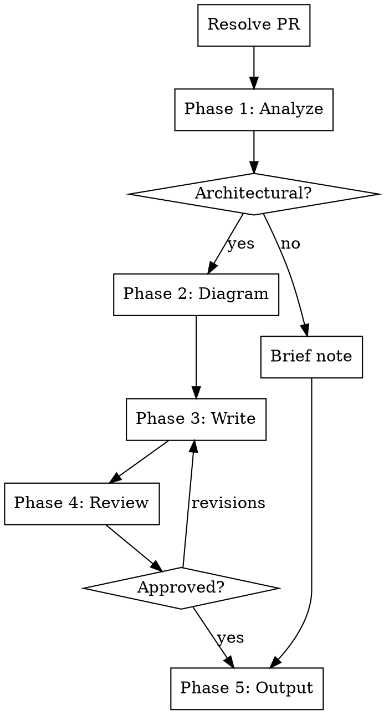
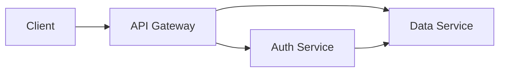
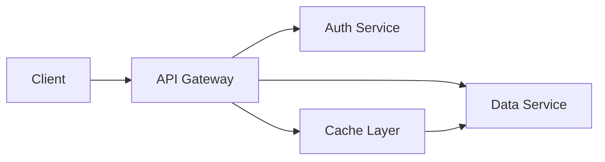

# Architecture Impact Analysis

Analyze a PR's impact on overall architecture. Produces a high-level before/after summary with mermaid diagrams showing what changed, what the change enables, and what risks or trade-offs it introduces.

## Audience

The output targets **decision makers**: engineering leads, PMs, and stakeholders who need to understand what changed and why it matters, not how it was implemented. Write and diagram at the level of **components, layers, and data flows**, not files, functions, or internal module structure.

## Input

This skill accepts PRs only.

Resolve the argument:

1. Matches GitHub URL or `#\d+` pattern -> **PR**
2. No argument -> ask: "Which PR should I analyze? Provide a PR URL or number."
3. Anything else -> "This skill analyzes PRs only. Provide a PR URL or number."

## Process Flow



**Do NOT skip phases.** Ask questions at a natural pace. If the user answers multiple at once, accept bundled answers and skip ahead.

If the user says "just pick defaults" or similar, pick reasonable defaults, state what you chose, and ask for a single confirmation.

## Phase 1: Analyze

### Step 1 - Read the PR

First, check the PR size using `gh pr view --json files,title,body,comments,reviews`. Use the structured JSON to understand file count and scope before reading the diff.

- PR title and description
- Review comments (use these for architectural context, decision rationale, and "I chose this approach because..." insights)
- Commit messages
- Files changed (list and count)

**For the diff:** if the PR has fewer than 20 changed files, read the full diff with `gh pr diff`. If 20+ files, selectively read only files that represent structural changes: new files, deleted files, renamed files, changed interfaces/APIs, config files, dependency files (package.json, go.mod, etc.). Skip test files and minor edits.

**Error handling:**
- `gh` not available -> inform user, suggest `gh auth login`. This skill cannot proceed without `gh`.
- Invalid PR number -> ask user to verify

### Step 2 - Read broader codebase context

Start by reading the directory tree structure (names only, not contents) to understand the overall shape. Then read:
- README and any architecture docs (if they exist)
- package.json or equivalent (for dependency context)
- Key files within the modules the PR touches and their direct dependencies only

For monorepos, scope to the packages the PR touches. Do not attempt to read the entire repo. If the PR references changes in other repos, note those references but stay within the current repo.

Goal: understand the current architecture before the PR. Look for:
- Directory structure and module boundaries
- Key abstractions and patterns
- Dependency graph (imports, package dependencies)
- Data flow patterns

### Step 3 - Identify the architectural changes

Classify the PR's changes:

**Structural changes** (new modules, moved boundaries, new layers):
- New files/directories that introduce new components
- Removed or deleted components/modules
- Files moved between modules (boundary changes)
- New abstractions or interfaces introduced

**Dependency changes** (new connections, removed connections):
- New imports between modules
- New external dependencies
- Removed dependencies or decoupled modules

**Data flow changes** (new paths, changed paths):
- New API endpoints or changed signatures
- New data models or schema changes
- Changed event/message flows

**Pattern changes** (new patterns, replaced patterns):
- New design patterns introduced (plugin system, event bus, middleware, etc.)
- Existing patterns replaced or evolved

**Architectural vs implementation detail:**
- Architectural: "switched from REST to GraphQL", "added a Redis cache layer", "introduced a plugin system", "split the monolith into two services"
- Implementation: "refactored a function into smaller helpers", "renamed variables", "added error handling to an endpoint", "updated a dependency version"
- Rule of thumb: if it changes how components relate to each other, it's architectural. If it changes what happens inside a component, it's implementation.

### Decision point: Is this PR architectural?

After Step 3, determine whether the PR introduces any structural, dependency, data flow, or pattern changes. If it does (even partially, e.g. a bug fix PR that also introduces a new module), proceed to Step 4.

If the PR has no architectural changes at all, produce a brief note:

> "This PR doesn't introduce architectural changes. It's a [bug fix / config change / etc.]. No architecture impact analysis needed."

Ask the user if they still want a full analysis. If no, skip to Phase 5 (output the brief note). If yes, proceed.

### Step 4 - Sensitive content check

Scan for security patches, credentials, internal pricing, or confidential architecture details that shouldn't be documented publicly. If found, flag each item and ask the user: include it, redact it, or stop the analysis. Proceed based on their answer.

### Step 5 - Present understanding

> "Here's what I see in this PR:"
>
> **Structural:** [summary]
> **Dependencies:** [summary]
> **Data flow:** [summary]
> **Patterns:** [summary]
>
> "Does this capture the intent of the PR? Anything I'm missing or misunderstanding?"

Do NOT proceed until the user confirms. If the user provides corrections or additions, incorporate them, re-present the updated summary, and wait for confirmation again.

## Phase 2: Diagrams

Generate before/after mermaid diagrams when the PR contains architectural changes. If the PR is a mix (mostly bug fixes but one new module), generate diagrams only for the architectural parts.

### When to generate diagrams

| Change type | Diagram type |
|---|---|
| New, removed, or restructured components/modules | Component diagram (before/after) |
| Changed module boundaries (files moved between modules) | Component diagram (before/after) |
| Changed data flow or API paths | Data flow diagram (before/after) |
| New or changed dependencies between modules | Dependency graph (before/after) |
| Replaced or evolved patterns | Component or data flow diagram showing the pattern change (before/after) |
| New sequence of operations | Sequence diagram (after only) |

### Abstraction level

Diagrams are for decision makers, not implementors. Show **how pieces talk to each other**, not internal structure.

| Do | Don't |
|---|---|
| Name components by role: "Runtime Core", "Express Adapter", "Agent Runner" | Name files: "fetch-handler.ts", "express.ts" |
| Name layers: "Routing Layer", "Auth Layer" | Name functions: "matchRoute()", "dispatchRoute()" |
| Show communication: "Client -> Runtime -> Agent" | Show imports or internal module wiring |
| Label arrows with what flows: "SSE stream", "REST", "JSON envelope" | Label arrows with function calls or variable names |
| Use subgraphs for logical boundaries: "Framework Adapters", "Core" | Use subgraphs for directories: "src/v2/runtime/core/" |

**Rule of thumb:** if a non-technical person can't understand the node label, it's too detailed. "Request Handler" is clear. "createCopilotRuntimeHandler" is not.

### Diagram format

Generate as mermaid code blocks. Use separate `before` and `after` diagrams (two sequential code blocks), clearly labeled:

````
**Before:**


**After:**

````

Keep diagrams focused. Show only the components relevant to the change, not the entire system.

If no architectural changes warrant diagrams, note: "No architectural diagrams needed for this change."

### Writing diagrams to file

Mermaid diagrams are not visually renderable in the terminal. Always write diagrams to a markdown file so the user can view them in a tool that renders mermaid (VS Code preview, GitHub, browser extensions, etc.).

Write the diagrams to a working draft file at the output path (see Phase 5 for path resolution). This file will be incrementally built through Phases 2-3.

After writing the file, tell the user:

> "I've written the before/after diagrams to `<path>`. Open it in a markdown previewer to see the rendered diagrams. Do they accurately represent the change?"

Wait for confirmation. If the user provides corrections, update the file and re-present.

## Phase 3: Write

Write the full analysis into the output file (the same file started in Phase 2, or a new file if Phase 2 was skipped). If diagrams were already written in Phase 2, prepend/append the analysis sections around them. Start with a header:

```
# Architecture Impact: PR #<number> - <PR title>
**Repo:** <owner/repo>
**Date:** <today's date>
```

### 1. Summary

One paragraph: what the PR does and why it matters architecturally. Readable by anyone on the team.

### 2. Before

Describe the architecture before the PR:
- How the affected area was structured
- What the constraints, limitations, or pain points were
- How data flowed through the affected components

Keep it brief. Only describe what's relevant to understanding the change.

### 3. After

Describe the architecture after the PR:
- What changed structurally
- How the affected area is now structured
- How data flows now

### 4. What this enables

What future possibilities does this change unlock? Examples:
- "The new plugin system means we can now support third-party extensions without modifying core code"
- "Decoupling the auth module means it can be deployed independently"
- "The new event bus allows any module to react to user actions without direct coupling"

Always include this section. Even incremental changes enable something, even if it's just "easier to test" or "simpler to extend."

### 5. Risks and trade-offs

What risks or trade-offs does this change introduce? Always include this section. Examples:
- New network hop increases latency
- New abstraction layer adds complexity
- Circular dependency introduced
- Migration required for existing consumers
- Performance implications of new pattern

If genuinely no risks, state: "No significant risks identified" with a brief explanation of why (e.g. "the change is additive and doesn't modify existing behavior").

### 6. Diagrams

Include the mermaid diagrams from Phase 2 (if generated).

### Writing rules

- **Audience is decision makers.** PMs, leads, stakeholders. They understand "the runtime now has a shared core that all frameworks use" but not "createCopilotRuntimeHandler delegates to dispatchRoute via a discriminated RouteInfo union."
- **Name components by role, not by file or function.** Say "the request handler", "the Express adapter", "the routing layer", not "fetch-handler.ts", "createCopilotRuntimeHandler()", "matchRoute()". File names and function names belong in code review, not architecture impact.
- **Describe how pieces talk to each other**, not what happens inside them. "All framework adapters now delegate to a shared core handler" is architectural. "The handler calls matchRoute which returns a RouteInfo discriminated union" is implementation.
- No implementation details unless they matter architecturally (see examples in Step 3)
- **Never use em-dashes** in the generated content. No "---" characters. Use commas, colons, periods, or parentheses instead.
- Short paragraphs, scannable
- Use concrete examples, not abstract descriptions

## Phase 4: Review

The full analysis document should already be written to the output file (built incrementally through Phases 2-3). Tell the user:

> "The complete architecture impact analysis is at `<path>`. Open it in a markdown previewer to review the full document with rendered diagrams. Want any changes?"

Wait for approval. Only proceed to output once the user confirms. Apply any requested changes by editing the file.

## Phase 5: Output

### Path resolution

Default output path: `docs/architecture/PR-<number>-impact.md`

At the start of Phase 2 (or Phase 3 if no diagrams), ask the user:

> "I'll write the analysis to `docs/architecture/PR-<number>-impact.md`. Want a different location?"

If the user specifies a different path, use that. Create the directory if it doesn't exist. If file already exists, ask whether to overwrite or create a versioned copy.

The file should already exist from Phases 2-3. Print a brief terminal summary (title, one-line summary, path to file) so the user knows where to find the full document. Do NOT print the full analysis to terminal.

## Error Handling

- `gh` not available -> cannot proceed, inform user
- Invalid PR -> ask user to verify
- PR too large to analyze fully -> focus on structural changes, note what was skipped

## What this skill does NOT do

- Code review (use code review tools for that)
- Generate marketing content (use `/marketing-pipeline` for that)
- Make architectural recommendations (it documents what changed, not what should change)
- Analyze multiple PRs at once (run the skill once per PR)
