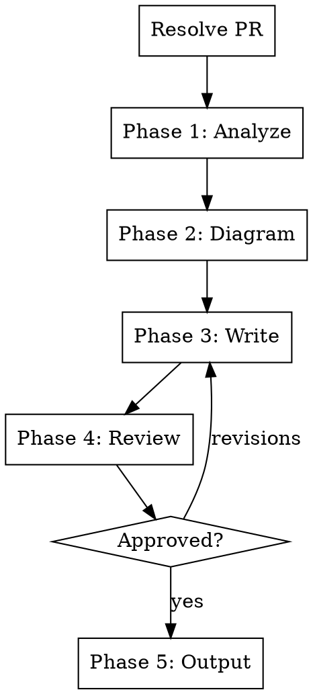

# Architecture Impact Analysis

Analyze a PR's impact on overall architecture. Produces a high-level before/after summary with mermaid diagrams showing what changed, what the change enables, and what risks or trade-offs it introduces.

## Input

This skill accepts PRs only.

Resolve the argument:

1. Matches GitHub URL or `#\d+` pattern -> **PR**
2. No argument -> ask: "Which PR should I analyze? Provide a PR URL or number."
3. Anything else -> "This skill analyzes PRs only. Provide a PR URL or number."

## Process Flow

**Do NOT skip phases.** Ask questions at a natural pace. If the user answers multiple at once, accept bundled answers and skip ahead.

If the user says "just pick defaults" or similar, pick reasonable defaults, state what you chose, and ask for a single confirmation.

## Phase 1: Analyze

### Step 1 - Read the PR

Read via `gh pr view` and `gh pr diff`:
- PR title and description
- Full diff
- Review comments
- Commit messages
- Files changed (list and count)

For large PRs (20+ files), focus on structural changes: new files/directories, deleted files, renamed files, changed interfaces/APIs, new dependencies.

**User-facing changes** include: new features, UI changes, API changes, performance improvements, bug fixes, and documentation updates. **Internal changes** include: refactors, test additions, CI changes, and dependency bumps. Both matter for architecture analysis.

**Error handling:**
- `gh` not available -> inform user, suggest `gh auth login`. This skill cannot proceed without `gh`.
- Invalid PR number -> ask user to verify

### Step 2 - Read broader codebase context

Read if they exist: README, docs/, package.json (or equivalent), any architecture docs, existing diagrams.

Goal: understand the current architecture before the PR. Look for:
- Directory structure and module boundaries
- Key abstractions and patterns
- Dependency graph (imports, package dependencies)
- Data flow patterns

If the codebase is too large to read fully, focus on the modules/directories affected by the PR and their immediate neighbors.

### Step 3 - Identify the architectural changes

Classify the PR's changes:

**Structural changes** (new modules, moved boundaries, new layers):
- New files/directories that introduce new components
- Files moved between modules (boundary changes)
- New abstractions or interfaces introduced

**Dependency changes** (new connections, removed connections):
- New imports between modules
- New external dependencies
- Removed dependencies or decoupled modules

**Data flow changes** (new paths, changed paths):
- New API endpoints or changed signatures
- New data models or schema changes
- Changed event/message flows

**Pattern changes** (new patterns, replaced patterns):
- New design patterns introduced (plugin system, event bus, middleware, etc.)
- Existing patterns replaced or evolved

### Step 4 - Sensitive content check

Scan for security patches, credentials, internal pricing, or confidential architecture details that shouldn't be documented publicly. Flag anything questionable to the user.

### Step 5 - Present understanding

> "Here's what I see in this PR:"
>
> **Structural:** [summary]
> **Dependencies:** [summary]
> **Data flow:** [summary]
> **Patterns:** [summary]
>
> "Does this capture the intent of the PR? Anything I'm missing or misunderstanding?"

Do NOT proceed until the user confirms.

## Phase 2: Diagrams

Generate before/after mermaid diagrams when the change is architectural (new components, changed data flow, new dependencies). Skip diagrams for small changes (bug fixes, config tweaks, copy changes).

### When to generate diagrams

| Change type | Diagram type |
|---|---|
| New components or modules | Component diagram (before/after) |
| Changed data flow or API paths | Data flow diagram (before/after) |
| New or changed dependencies between modules | Dependency graph (before/after) |
| New sequence of operations | Sequence diagram (after only) |

Generate as mermaid code blocks. Use `before` and `after` as separate diagrams side by side, not a single combined diagram.

If the change is not architectural (bug fix, config change, copy edit), skip diagrams entirely and note: "No architectural diagrams needed for this change."

Present the diagrams to the user:

> "Here are the before/after diagrams. Do they accurately represent the change?"

Wait for confirmation before proceeding.

## Phase 3: Write

Produce a high-level analysis document with these sections:

### 1. Summary

One paragraph: what the PR does and why it matters architecturally. Readable by anyone on the team.

### 2. Before

Describe the architecture before the PR:
- How the affected area was structured
- What the constraints, limitations, or pain points were
- How data flowed through the affected components

Keep it brief. Only describe what's relevant to understanding the change.

### 3. After

Describe the architecture after the PR:
- What changed structurally
- How the affected area is now structured
- How data flows now

### 4. What this enables

What future possibilities does this change unlock? Examples:
- "The new plugin system means we can now support third-party extensions without modifying core code"
- "Decoupling the auth module means it can be deployed independently"
- "The new event bus allows any module to react to user actions without direct coupling"

Always include this section. Even incremental changes enable something, even if it's just "easier to test" or "simpler to extend."

### 5. Risks and trade-offs

What risks or trade-offs does this change introduce? Always include this section. Examples:
- New network hop increases latency
- New abstraction layer adds complexity
- Circular dependency introduced
- Migration required for existing consumers
- Performance implications of new pattern

If genuinely no risks, state: "No significant risks identified" with a brief explanation of why (e.g. "the change is additive and doesn't modify existing behavior").

### 6. Diagrams

Include the mermaid diagrams from Phase 2 (if generated).

### Writing rules

- High-level, readable by anyone on the team (PMs, leads, engineers)
- No implementation details unless they matter architecturally
- **Never use em-dashes** in the generated content. No "---" characters. Use commas, colons, periods, or parentheses instead.
- Short paragraphs, scannable
- Use concrete examples, not abstract descriptions

## Phase 4: Review

Present the complete analysis:

> "Here's the architecture impact analysis:"
>
> [Full document]
>
> "Want any changes?"

Wait for approval. Only proceed to output once the user confirms.

## Phase 5: Output

Always print the final analysis to terminal.

Then ask: "Want me to save this to a file? If so, where?"

If the user confirms, save to the specified path. Create the directory if it doesn't exist. If file already exists, ask whether to overwrite or create a versioned copy.

## Error Handling

- `gh` not available -> cannot proceed, inform user
- Invalid PR -> ask user to verify
- PR too large to analyze fully -> focus on structural changes, note what was skipped
- No architectural changes detected -> produce a brief note: "This PR doesn't introduce architectural changes. It's a [bug fix / config change / etc.]." and ask if the user still wants a full analysis.

## What this skill does NOT do

- Code review (use code review tools for that)
- Generate marketing content (use `/marketing-pipeline` for that)
- Make architectural recommendations (it documents what changed, not what should change)
- Analyze multiple PRs at once (run the skill once per PR)
