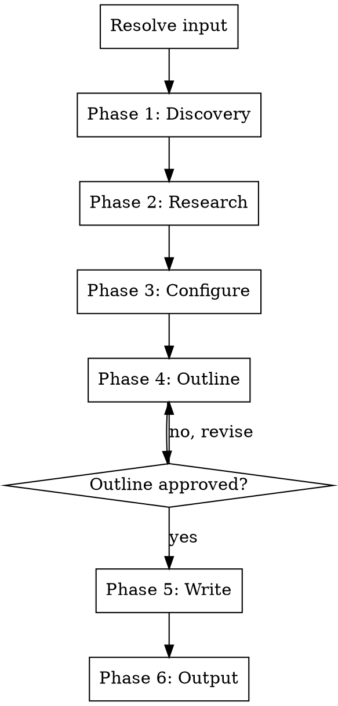

# Blog Post Writer

Write high-quality blog posts from code changes, marketing briefs, or feature descriptions. Handles SEO, structure, tone matching, and visual content.

## Input Resolution

Resolve the argument (if provided) in this order:

1. Path to an existing marketing brief file (`.md` containing "Executive Summary" or "Key Messages") → **marketing brief**
2. Matches GitHub URL or `#\d+` pattern → **PR**
3. Contains `...` or `..` → **git ref range**
4. Resolves to existing file/directory → **codebase feature**
5. Otherwise → **freeform text**

If no argument is provided, ask: "What should I write about? You can provide a marketing brief path, PR URL/number, git ref range (e.g. v1.0...v2.0), file/directory path, or just describe the topic."

If multiple interpretations match, confirm with the user.

## Process Flow



**One question per message.** If the user answers multiple questions at once, accept their bundled answers and skip ahead. Never make assumptions without confirming.

## Phase 1: Discovery

### Step 1 — Analyze the input

| Input type | What to read |
|---|---|
| Marketing brief | Read the brief — extract problem statement, value prop, audience, key messages, competitive positioning. Still do Step 2 if the brief lacks product context, then proceed to Step 3. |
| PR | Diff, PR description, review comments, commit messages (`gh pr view`, `gh pr diff`). For large PRs, focus on user-facing changes. |
| Git refs | `git diff` and `git log` between the refs. For large ranges, prioritize commit messages and user-facing changes. |
| Codebase feature | Read the specified files/directories. |
| Freeform text | Parse the user's description. |

**Error handling:**
- `gh` not installed/authenticated → inform user, suggest `gh auth login`, offer alternative input
- Invalid PR/ref → tell user, ask to verify
- File not found → ask for correct path

### Step 2 — Read broader product context

Read if they exist: README, docs/, package.json (or equivalent), marketing references.

Goal: understand what the product is, who it's for, what it does.

If nothing found, ask: "I couldn't find product context in the repo. Can you briefly describe the product and who it's for?"

### Step 3 — Present understanding

> "Here's what I understand:"
>
> - [ ] Feature A — short description
> - [ ] Feature B — short description
>
> "Which of these should the blog post cover? Anything to add, remove, or correct?"

Ask at most 2-3 clarifying questions per round. Do NOT proceed until the user confirms scope.

### Step 4 — Flag sensitive items

Scan for: breaking changes, deprecations, security fixes, migration requirements.

If found, flag each and ask how to frame them before proceeding.

## Phase 2: Competitive Blog Research

Before configuring the post, search for similar blog posts in the space:

1. Use WebSearch to find 3-5 existing blog posts covering the same topic, competing products, or similar feature announcements
2. Analyze what works and what doesn't in those posts — structure, headlines, hooks, SEO keywords, depth
3. Identify content gaps — what are competitors NOT covering that this post could
4. Use these findings to inform SEO strategy, headline generation, and content structure

If WebSearch is unavailable, skip this phase and rely on your own knowledge.

Present a brief summary to the user:

> "I found some similar posts in the space. Here's what I noticed:"
> - [Key findings about what works]
> - [Content gaps / opportunities]
> - [SEO keyword opportunities]
>
> "I'll use these insights to shape the post."

## Phase 3: Configuration

Ask these one at a time:

**Q1 — Audience:** "Who is this blog post for?" (developers, end users, technical decision-makers, general audience, other)

**Q2 — Tone:** Read existing blog posts, README, and docs in the repo to detect the product's voice. Then confirm:

> "Based on your existing content, the tone seems [e.g. conversational and developer-friendly]. Should I match that or go a different direction?"

If no existing content to analyze, ask directly what tone the user wants.

**Q3 — Post type:** Based on the input and audience, recommend a post type and confirm:

- **Feature announcement** — "We shipped X, here's why it matters" (~600-1000 words)
- **Deep-dive technical** — "How we built X, the decisions and architecture" (~1500-2500 words)
- **Problem-solution narrative** — "You have problem X, here's how this solves it" (~1000-2000 words)

> "Given the [input/audience], I'd recommend a [type] post because [reason]. Sound right?"

**Q4 — CTA:** Infer the most appropriate call to action from context:
- Open source → star the repo, contribute, try it out
- SaaS → sign up, start free trial
- Feature update → try the new feature, read the docs
- Library/SDK → install it, read the migration guide

> "I'd suggest the CTA be: [inferred CTA]. Want to go with that or something different?"

**Q5 — Involvement level:** "How involved do you want to be in the writing process?"
- **A) Just write it** — I'll handle everything and show you the final result
- **B) Show me the outline first** — approve the structure, then I'll write the full post
- **C) Walk me through it** — outline approval, then section-by-section with confirmation

## Phase 4: Outline

Generate a structured outline:

```
## [Working title]

1. **Hook/Introduction** — [approach: question/statistic/bold statement/story]
   - Key point to establish
   - Transition to body

2. **Section Name** — [purpose]
   - Key points
   - Estimated word count

3. **Section Name** — [purpose]
   - Key points
   - Estimated word count

[...as many sections as needed]

N. **Conclusion** — [summary + CTA]
   - Key takeaway to reinforce
   - CTA: [specific action]

Estimated total: ~X words
```

If involvement level is A, generate the outline internally without showing it. For B and C, present it and wait for approval.

## Phase 5: Write

### Internal writing process (always runs, regardless of involvement level)

For each section:

1. **Write the section**
2. **Self-review:** analyze whether the content could be structured differently, is missing context the reader needs to understand and digest it, or has gaps that would confuse someone unfamiliar with the topic
3. **Backfill:** if missing pieces are found, add bridging paragraphs, context, or restructure before moving on

If involvement level is C, present each section after self-review and get confirmation before proceeding. For A and B, run this process silently.

### Headlines

After the body is complete, generate **3-5 headline options** using different formulas:

- How-to ("How [Product] solves [problem]")
- Number/list ("3 reasons [feature] changes [workflow]")
- Question ("Tired of [pain point]?")
- Bold statement ("[Feature] is the fastest way to [outcome]")
- Before/after ("[Pain] → [Result]: How [feature] makes it happen")

**Recommend one** and explain why it works best for this post's audience, SEO, and context. Also explain the trade-offs of the others.

For involvement levels B and C, present the options and get the user's selection before proceeding. For level A, use your recommendation.

Target: 6-12 words for the headline. Punchy and clear.

### SEO Frontmatter

Generate as YAML frontmatter at the top of the post:

```yaml
---
title: "[Selected headline]"
meta_description: "[140-160 chars, includes primary keyword, compelling value prop]"
primary_keyword: "[main target keyword]"
secondary_keywords: ["keyword1", "keyword2", "keyword3"]
long_tail_keywords: ["longer phrase 1", "longer phrase 2"]
slug: "[url-friendly-slug]"
---
```

Rules:
- Title tag: 50-60 chars, primary keyword front-loaded
- Meta description: 140-160 chars, written for humans, includes unique value prop
- Keywords informed by Phase 2 competitive research
- No keyword stuffing — natural language only

### Content formatting rules

- **Short paragraphs:** 2-4 sentences max
- **Subheadings:** use H2 for main sections, H3 for subsections. Subheadings should work as a scannable outline on their own.
- **Bold key phrases** to support F-pattern scanning
- **Bullet points and lists** for any set of 3+ items
- **One idea per paragraph**

### Hook/Introduction

The intro has three components:

1. **Hook** (first 1-2 sentences) — a surprising statistic, bold claim, relatable pain point, or provocative question. Must create curiosity or emotional resonance in under 3 seconds of reading.
2. **Authority** — briefly establish why this matters or why the reader should trust this
3. **Promise** — clearly state what the reader will get from this post

Keep the intro to 3-5 short paragraphs. No walls of text.

### Conclusion

1. Restate the main takeaway (do NOT introduce new ideas)
2. Single, clear CTA with action verb ("Try it now", "Star the repo", "Start your free trial")
3. Optionally end with a forward-looking statement or question to spark discussion

### Visual content

**Generate directly when possible:**
- Architecture diagrams → mermaid code blocks or inline SVG
- Data flow diagrams → mermaid code blocks
- Comparison tables → markdown tables
- Code examples → syntax-highlighted code blocks

**For images that need external creation:**
```markdown
<!-- TODO: Add image here -->
<!-- Suggestion: [description of what the image should show] -->
<!-- LLM prompt: "[ready-to-use prompt for an image generation model, e.g. 'A clean, minimal illustration showing a dashboard with dark mode toggle, flat design style, developer tool aesthetic, 16:9 ratio']" -->

```

Use visuals wherever they help comprehension — after explaining a complex concept, when comparing options, or when showing UI changes.

## Phase 5b: Full Draft Review

After all sections are written and the headline is selected, assemble the complete post (frontmatter + body).

- **Level A:** Present the full draft to the user for review before saving.
- **Level B:** Present the full draft to the user for review before saving.
- **Level C:** The user has seen each section individually, but still present the assembled draft for a final review.

> "Here's the complete post. Want any changes before I save it?"

If the user requests revisions, make them and present again. Only proceed to output once the user approves.

## Phase 6: Output

**Detect existing blog directory first.** Check for:
- `content/blog/`, `src/pages/blog/`, `_posts/`, `blog/`, `posts/`, `articles/`

If found, use that directory. If not, default to `blog/posts/`.

Present to the user:

> "I'll save this to `[detected-or-default-path]/<slug>.md`. Want it somewhere else, or should I skip saving and just print it?"

Create the directory if it doesn't exist.

**If file already exists:** ask whether to overwrite or create a versioned copy.

## Error Handling

- `gh` not available → inform user, offer alternative input
- Invalid PR/ref → ask user to verify
- No product context → ask user to describe the product
- WebSearch unavailable → skip Phase 2, proceed with own knowledge
- No existing blog directory → default to `blog/posts/`, create it

## What this skill does NOT do

- Generate social media copy (use `/social-copy` for that)
- Publish or deploy the post to any platform
- Generate marketing briefs (use `/marketing-brief` for that)
- Create multiple variants for different audiences — run the skill again for a different audience
