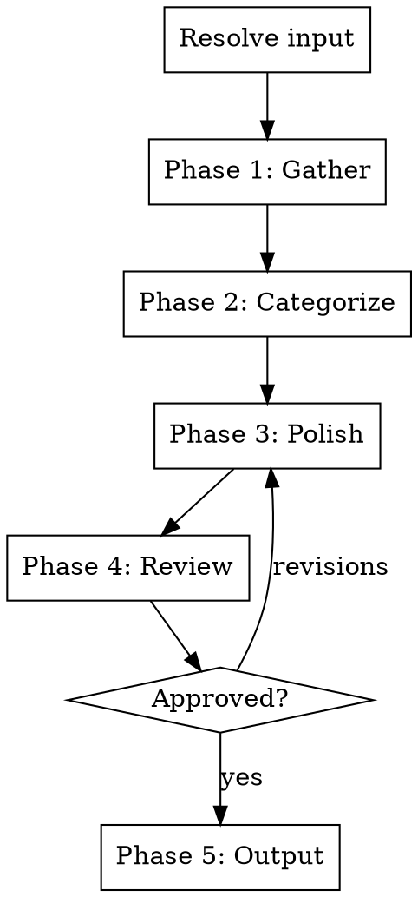

# Changelog Generator

Auto-generate human-friendly changelogs from git history. Follows Keep a Changelog format, polishes commit messages into user-friendly language, and optionally creates GitHub Releases.

## Input Resolution

The primary input is a git ref range. Resolve the argument (if provided):

1. Contains `...` or `..` -> **git ref range** (e.g. `v1.0.0...v1.1.0`)
2. Matches a single tag/ref -> **from that ref to HEAD**
3. Matches GitHub URL or `#\d+` pattern -> **PR** (extract changes from that PR only)
4. No argument -> ask: "What range should the changelog cover? You can provide a git ref range (e.g. v1.0.0...v1.1.0), a tag (changes since that tag), or a PR number."

## Process Flow



**Do NOT skip phases.** Ask questions at a natural pace. If the user answers multiple at once, accept bundled answers and skip ahead.

If the user says "just pick defaults" or similar, pick reasonable defaults, state what you chose, and ask for a single confirmation.

## Phase 1: Gather

### Step 1 - Collect commits and PRs

Run `git log` between the two refs to collect all commits. If the repo uses PRs, also check for merged PRs in the range using `gh pr list --state merged`.

For each commit/PR, extract:
- Commit message (subject + body)
- Files changed (to determine scope)
- PR title and description (if available)
- Any conventional commit type prefix (feat, fix, chore, etc.)

### Step 2 - Read broader product context

Read if they exist: README, package.json (or equivalent). Goal: understand what the product is to write user-friendly descriptions.

If nothing found, ask: "Can you briefly describe the product? I need context to write user-friendly changelog entries."

### Step 3 - Detect existing format

Check if the repo has an existing `CHANGELOG.md`. If it does:
- Detect the format (Keep a Changelog, custom, etc.)
- Detect whether it uses emoji labels (e.g. emojis for New, Bug fix, Breaking) or plain text categories
- Match the existing style

If no existing changelog:
- Default to Keep a Changelog format
- Ask: "No existing changelog found. Do you prefer emoji labels (e.g. for New, Bug fix) or plain text categories (Added, Fixed, etc.)?"

## Phase 2: Categorize

Sort all changes into Keep a Changelog categories:

- **Added** - new features
- **Changed** - changes to existing functionality
- **Deprecated** - features that will be removed
- **Removed** - features that were removed
- **Fixed** - bug fixes
- **Security** - vulnerability fixes

**Categorization rules:**
- If commits follow conventional commits (`feat:`, `fix:`, etc.), use the type to categorize
- If not, analyze the diff and commit message to determine the category
- Skip internal-only changes (refactors, test additions, CI changes, dependency bumps) unless they affect user-facing behavior
- When uncertain whether a change is user-facing, include it and let the user remove it in review

Present the categorized list:

> "Here's what I found in this range:"
>
> **Added (3)**
> - Feature A
> - Feature B
> - Feature C
>
> **Fixed (2)**
> - Bug fix A
> - Bug fix B
>
> "Anything to add, remove, or recategorize?"

Do NOT proceed until the user confirms.

## Phase 3: Polish

Rewrite each entry into human-friendly language:

- Lead with the user benefit, not the implementation detail
- "Reports now load 3x faster" not "Optimized SQL query execution plan for reporting module"
- "You can now export reports to PDF" not "Added PDF export functionality to the reporting service"
- Keep each entry to one line (two max for complex changes)
- Include PR/issue references where available (e.g. `(#123)`)

### Version header

Format: `## [version] - YYYY-MM-DD`

If the version is not obvious from the ref range, ask: "What version number should this changelog use?"

Use ISO date format (YYYY-MM-DD).

### Technical appendix

After generating the user-friendly changelog, ask:

> "Want me to also generate a technical appendix with implementation details? (useful for developer-facing docs)"

If yes, generate a more detailed section with technical specifics, breaking change migration guides, and API changes.

### Writing rules

- **Never use em-dashes** in the generated content. No "---" characters. Use commas, colons, periods, or parentheses instead.
- User-friendly language by default (no jargon, no internal feature names)
- One line per entry, two max for complex changes
- Consistent verb tense (past tense: "Added", "Fixed", "Removed")
- Include PR/issue references where available

## Phase 4: Review

Present the complete changelog entry:

> "Here's the changelog:"
>
> ```
> ## [1.2.0] - 2026-04-11
>
> ### Added
> - You can now export reports to PDF (#123)
>
> ### Fixed
> - Dashboard no longer flickers on page load (#456)
> ```
>
> "Want any changes?"

Wait for approval. Only proceed to output once the user confirms.

## Phase 5: Output

### CHANGELOG.md

Detect existing `CHANGELOG.md` in the repo root. If found, prepend the new entry at the top (below the file header). If not found, create one with a standard header:

```
# Changelog

All notable changes to this project will be documented in this file.

The format is based on [Keep a Changelog](https://keepachangelog.com/).
```

Always confirm before writing:

> "I'll prepend this to `CHANGELOG.md`. Good to go?"

### GitHub Release

After saving the changelog, ask:

> "Want me to also create a GitHub Release with this changelog?"

If yes, use `gh release create <tag> --notes "<changelog content>"` to create the release. If `gh` is not available, inform the user and skip.

## Error Handling

- `gh` not available -> inform user, skip PR enrichment and GitHub Release, rely on git log only
- Invalid ref/tag -> ask user to verify
- No commits in range -> tell user, ask to verify the range
- No product context -> ask user to describe the product
- Non-conventional commits -> fall back to diff analysis for categorization

## What this skill does NOT do

- Manage versioning strategy (semantic versioning decisions are up to the user)
- Publish to package registries
- Generate blog posts or newsletters (use `/blog-post` or `/newsletter`)
- Handle branching strategies or release workflows
