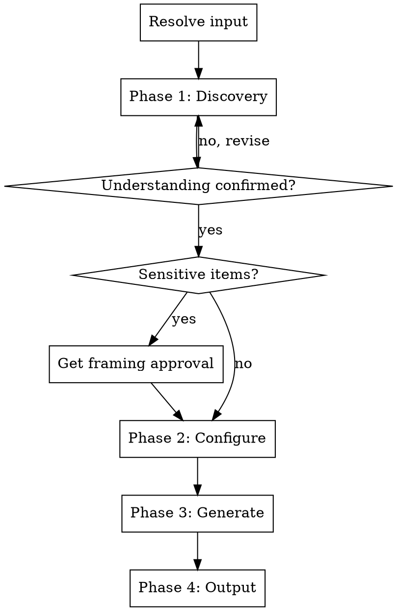

# Marketing Brief Generator

Generate structured marketing briefs from code changes. Designed for non-marketers who need professional-quality briefs.

## Input Resolution

Resolve the argument (if provided) in this order:

1. Matches GitHub URL or `#\d+` pattern → **PR**
2. Contains `...` or `..` → **git ref range**
3. Resolves to existing file/directory → **codebase feature**
4. Otherwise → **freeform text**

If no argument is provided, ask: "What should I analyze? You can provide a PR URL/number, a git ref range (e.g. v1.0...v2.0), a file/directory path, or just describe the feature."

If multiple interpretations match, confirm with the user.

## Process Flow

**Do NOT skip phases.** Ask questions at a natural pace. Don't overwhelm, but don't artificially slow things down either. If the user answers multiple questions at once, accept their bundled answers and skip ahead.

If the user says "just pick defaults", "you choose", or similar, pick reasonable defaults based on context, state what you chose, and ask for a single confirmation before proceeding.

Never make assumptions without confirming with the user. Be conversational and guide them through the process.

## Phase 1: Discovery

### Step 1 — Analyze the input

| Input type | What to read |
|---|---|
| PR | Diff, PR description, review comments, commit messages (`gh pr view`, `gh pr diff`). For large PRs (20+ files), focus on user-facing changes. |
| Git refs | `git diff` and `git log` between the two refs. For large ranges, prioritize commit messages and user-facing changes. |
| Codebase feature | Read the specified files/directories. |
| Freeform text | Parse the user's description. If it lacks specifics (no feature name, no value prop, no context), ask the user to provide more detail or point to a specific file/PR. Fall back to open-ended questions only if they can't. |

**User-facing changes** include: new features, UI changes, API changes, performance improvements, bug fixes, and documentation updates. **Internal changes** include: refactors, test additions, CI changes, and dependency bumps. When uncertain, list what you found and ask the user which are relevant.

**Error handling:**
- `gh` not installed/authenticated → inform user, suggest `gh auth login`, offer alternative input type
- Invalid PR number or git ref → tell user it wasn't found, ask to verify
- File/directory not found → tell user, ask for correct path

### Step 2 — Read broader product context

Read these if they exist: README, docs/, package.json (or equivalent), any marketing/landing page references.

Goal: understand what the product is, who it's for, what it does.

If none of these exist, ask the user: "I couldn't find product context in the repo. Can you give me a brief description of the product — what it is and who it's for?"

### Step 3 — Present understanding

Present a structured summary:

> "Here's what I understand was built:"
>
> - [ ] Feature A — short description
> - [ ] Feature B — short description
> - [ ] Feature C — short description
>
> "Please confirm, correct, add, or remove items. Which of these should be included in the brief?"

Ask clarifying questions for anything ambiguous. Do NOT proceed until the user confirms the feature scope.

### Step 4 — Flag sensitive items

Scan for: breaking changes, deprecations, security fixes, migration requirements, removed features, controversial decisions.

If found, flag each one:

> "I detected some items that need careful framing:"
>
> - **Breaking change:** `oldMethod()` was removed
> - **Deprecation:** v1 API endpoints marked deprecated
>
> "How would you like each of these framed in the brief?"

Do NOT proceed to Phase 2 until framing is agreed upon for every sensitive item.

## Phase 2: Brief Configuration

Ask these questions:

**Q1 — Audience:** "Who will read this brief?" (you personally, marketing team, designer, stakeholders, other)

**Q2 — Detail level:** "How detailed should the brief be?" (concise/scannable, moderate, or detailed/prose). The detail level influences depth and tone, not hard word limits. Concise means short punchy sections. Detailed means full prose with depth.

**Q3 — Competitors:** "Are there any competitors you want me to position against? I'll also do my own web research."

**Q4 — Conditional sections:** Evaluate which optional sections are relevant based on the feature context. Present all relevant proposals in a single message, and let the user approve or decline each:

> "I think **[section]** would be useful here because [reason]. Want me to include it?"

Optional sections and when to propose them:

| Section | Propose when |
|---|---|
| Tone & Voice Guidance | Audience is marketing team or designer who will produce copy |
| Visual/Asset Suggestions | Feature has UI component or is visually demonstrable |
| Timeline/Launch Window | Change is part of a larger release or has coordination needs |
| Success Metrics/KPIs | Audience is stakeholders or marketing team measuring impact |
| Risks/Sensitivities | Breaking changes, deprecations, or migrations detected |

Only propose sections you genuinely believe add value. Do not propose all of them every time.

## Phase 3: Brief Generation

### Always-included sections

Write all of these in order:

1. **Executive Summary** — one-paragraph TL;DR of the feature/change
2. **Problem Statement** — what pain point this solves, why it matters
3. **Solution Overview** — what was built, how it works (non-technical, accessible language)
4. **Technical Summary** — what was built, how it works (technical detail). If audience is non-technical, shorten to key implementation details only.
5. **Target Audience** — who benefits, persona descriptions tailored to the product
6. **Value Proposition** — why the audience should care, the key benefit
7. **Competitive Positioning** — comparison to alternatives. Combine user-named competitors with independent web research (use WebSearch). If WebSearch is unavailable, rely on user-provided competitors and your own knowledge. If no competitors found by either source, ask the user: replace with a Market Landscape section describing the category, or omit entirely for internal-only features. If the feature is clearly internal (CI pipeline, admin tool, dev tooling, infrastructure), ask the user: "This looks like an internal change. Skip competitive positioning?" and omit if they confirm.
8. **Key Messages** — 3-5 punchy, ready-to-use talking points
9. **Suggested Channels** — where to distribute (blog, social media, newsletter, documentation, etc.)
10. **Call to Action** — what the reader should do after learning about this
11. **SEO Keywords** — relevant search terms to target

### Conditionally-included sections

Include only those approved in Phase 2, Q4.

### Adaptation rules

- **Depth, tone, and emphasis** adapt to the stated audience and detail level
- Both Solution Overview and Technical Summary are always present (briefs may be forwarded to mixed audiences)
- Key Messages should be directly usable as copy — not vague summaries

## Phase 4: Output

**Default:** save as `docs/marketing/brief-<feature-slug>.md` in the repo AND print to terminal. Create the `docs/marketing/` directory if it does not exist.

Before saving, ask: "I'll save this to `docs/marketing/brief-<slug>.md`. Want it somewhere else, or should I skip saving and just print it?"

**Feature slug source:**

| Input type | Slug derived from |
|---|---|
| PR | PR title |
| Git refs | Tag/ref name |
| Codebase feature | Directory name |
| Freeform text | Ask the user |

Slug rules: kebab-case, max 50 characters, alphanumeric and hyphens only.

**If file already exists:** ask whether to overwrite or create a versioned copy (e.g. `brief-dark-mode-v2.md`).

## What this skill does NOT do

- Generate draft marketing copy (tweets, blog posts, emails)
- Publish or distribute anything
- Create design assets
