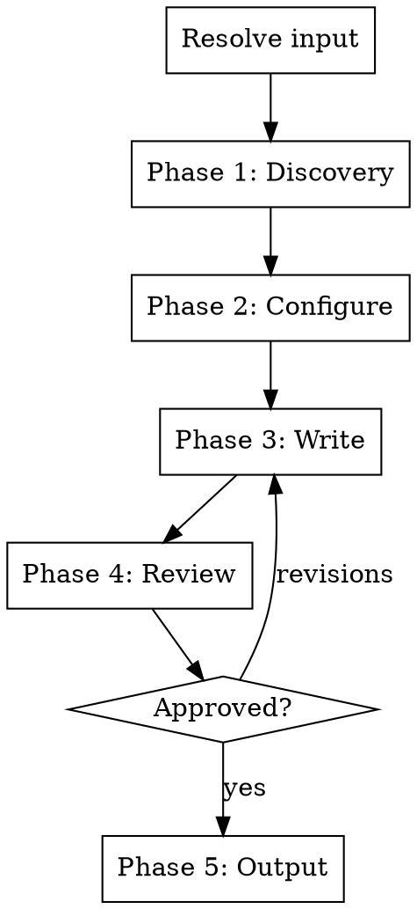

# Newsletter Writer

Write product update emails and feature announcement newsletters. Handles subject lines, preview text, email structure, and audience-appropriate content.

## Input Resolution

Resolve the argument (if provided) in this order:

1. Path to an existing marketing brief (`.md` containing "Executive Summary" or "Key Messages") -> **marketing brief**
2. Path to an existing blog post (`.md` with blog post structure) -> **blog post**
3. Path to an existing changelog (`.md` with Added/Fixed/Changed sections or CHANGELOG.md) -> **changelog**
4. Matches GitHub URL or `#\d+` pattern -> **PR**
5. Contains `...` or `..` -> **git ref range**
6. Resolves to existing file/directory -> **codebase feature**
7. Otherwise -> **freeform text**

If no argument is provided, ask: "What should the newsletter cover? You can provide a marketing brief, blog post, changelog, PR URL/number, git ref range, file/directory path, or just describe the update."

If multiple interpretations match, confirm with the user.

## Process Flow

**Do NOT skip phases.** Ask questions at a natural pace. If the user answers multiple questions at once, accept bundled answers and skip ahead.

If the user says "just pick defaults", "you choose", or similar, pick reasonable defaults based on context, state what you chose, and ask for a single confirmation before proceeding.

Never assume without confirming.

## Phase 1: Discovery

### Step 1 - Analyze the input

| Input type | What to read |
|---|---|
| Marketing brief | Extract problem statement, value prop, audience, key messages. Skip to Step 3. Still do Step 2 if brief lacks product context. |
| Blog post | Extract headline, key points, audience, CTA. Skip to Step 3. Still do Step 2 if lacking product context. |
| Changelog | Extract all entries. Use as the basis for a digest email. Skip to Step 3. |
| PR | Diff, PR description, review comments, commit messages (`gh pr view`, `gh pr diff`). For large PRs (20+ files), focus on user-facing changes. |
| Git refs | `git diff` and `git log` between refs. For large ranges, prioritize commit messages and user-facing changes. |
| Codebase feature | Read the specified files/directories. |
| Freeform text | Parse the user's description. If it lacks specifics, ask the user to provide more detail or point to a specific file/PR. Fall back to open-ended questions only if they can't. |

**User-facing changes** include: new features, UI changes, API changes, performance improvements, bug fixes, and documentation updates. **Internal changes** include: refactors, test additions, CI changes, and dependency bumps. When uncertain, list what you found and ask the user which are relevant.

**Error handling:**
- `gh` not available -> inform user, suggest `gh auth login`, offer alternative input
- Invalid PR/ref -> ask user to verify
- File not found -> ask for correct path

### Step 2 - Read broader product context

Read if they exist: README, docs/, package.json (or equivalent).

If nothing found, ask: "I couldn't find product context in the repo. Can you briefly describe the product and who it's for?"

### Step 3 - Present understanding and determine format

Present a structured summary:

> "Here's what I'll base the newsletter on:"
>
> - Update A - short description
> - Update B - short description
>
> "Anything to add, remove, or correct?"

Then determine the email format based on the number of updates:
- **Single major update** -> single feature email (focused, deep)
- **Multiple updates** -> digest email (prioritized list, most important expanded)

Confirm the format with the user.

Do NOT proceed until the user confirms scope and format.

## Phase 2: Configuration

Ask these questions:

**Q1 - Audience:** "Who is this email going to?" (all users, power users, new users, specific plan tier, developers, non-technical users, other)

**Q2 - Output format:** "What format do you want the email in?"
- **Copy only** - subject line, preview text, body text, CTA text (drop into your email tool)
- **Markdown** - formatted markdown that most email tools can import
- **HTML** - basic HTML email template with inline styles, ready to send

**Q3 - CTA:** Infer the most appropriate call to action from context:
- New feature -> "Try it now", "See what's new"
- Improvement -> "Check it out", "See the difference"
- Open source -> "Update now", "See the release"

> "I'd suggest the CTA be: [inferred CTA]. Want to go with that or something different?"

## Phase 3: Write

### Subject lines

Generate **3-5 subject line options** with different approaches:
- Benefit-driven ("Your reports now export to PDF")
- Curiosity ("We rebuilt how search works")
- Specific feature name ("Introducing dark mode")
- Question ("Still waiting for exports to finish?")
- Urgency/timeliness ("New this week: 3 features you asked for")

**Recommend one** and explain why it works best. Also explain the trade-offs of the others.

Rules:
- 30-50 characters optimal (avoid truncation on mobile)
- Be specific, not generic ("New: PDF exports" beats "Product Update - March 2026")
- No spam trigger words (Free, Buy Now, Act Now)

### Preview text

Generate preview text for each subject line option. Preview text is the secondary line visible in inbox previews.

Rules:
- 40-130 characters
- Expand on the subject line, don't repeat it
- Include the key benefit or outcome

### Email body

**Single feature email structure:**

1. **Problem statement** - one sentence describing the pain point this solves
2. **What changed** - 2-3 sentences describing the update in user-benefit language ("Reports load faster" not "Optimized SQL query execution")
3. **Visual placeholder** - `<!-- TODO: Add screenshot or GIF showing the feature in action -->` with a description of what to capture
4. **CTA button** - single clear action

**Digest email structure:**

1. **Lead update** - the most important update gets the full single-feature treatment (problem, what changed, visual, CTA)
2. **Secondary updates** - brief bullets with one-line descriptions and links
3. **Quick fixes / improvements** - grouped list of smaller changes
4. **Closing CTA** - single action or "See all updates"

### Writing rules

- Lead with user benefit, not what you built
- Conversational tone, not corporate
- Short paragraphs (2-3 sentences max)
- One idea per paragraph
- **Never use em-dashes** in the generated content. No "---" characters. Use commas, colons, periods, or parentheses instead.
- No jargon. "Reports load faster" beats "Optimized SQL query execution plan"
- Bold key phrases for scannability

### Segment variants

After generating the primary email, ask:

> "Want me to generate variants for different audience segments? (e.g. a more technical version for developers, a simpler version for non-technical users)"

If yes, generate the requested variants, adjusting tone, depth, and feature emphasis per segment.

## Phase 4: Review

Present the complete email:

> "Here's the newsletter:"
>
> **Subject line options:** (with recommendation)
> **Preview text:** (matching recommended subject)
> **Body:**
> [full email content]
>
> "Pick a subject line and let me know if you want any changes."

Wait for the user to select a subject line and approve or request revisions. Only proceed to output once approved.

## Phase 5: Output

Always print the final approved email to terminal.

Then ask: "Want me to save this to `emails/<slug>.md`? Or a different path?"

Create the directory if it doesn't exist. If file already exists, ask whether to overwrite or create a versioned copy.

## Error Handling

- `gh` not available -> inform user, offer alternative input
- Invalid PR/ref -> ask user to verify
- No product context -> ask user to describe the product
- No existing email directory -> default to `emails/`, create it

## What this skill does NOT do

- Send or schedule emails
- Manage subscriber lists or segmentation logic
- Create email templates or design systems
- Generate blog posts or social copy (use `/blog-post` or `/social-copy`)
