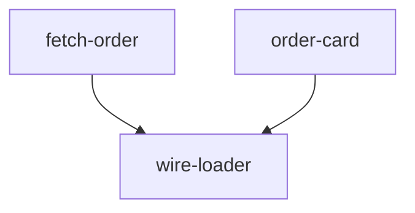

# Lego Plan

Turn a settled change into a **layered DAG** from simple primitives to a working feature. Plan only. Then stop.

The graph is a pyramid: many independent blocks at the bottom, composed blocks above, one finish node. A later workflow can run same-layer nodes in parallel and mark them done on this same graph. This skill does not dispatch subagents. It does not load other skills.

## When To Use

Load when the job is to turn a **settled change** into an implementation map the driver can follow.

- **Need:** what to build is already chosen. If a files-to-touch list or path pick is already in this conversation, use it. If not, work from the settled intent and the code. Do not go invent a second system map.
- **Skip:** typos, comments, formatting, docs with no code.
- **If intent is still open:** stop. Ask until the change is settled. Do not stack blocks for a feature that is not chosen.

## Hard Gates

1. **Plan only.** Do not write production code. Do not write tests. Name the check in “done when.” Do not implement it here.
2. **Stop after the DAG.** Do not dispatch. Do not load the next skill.
3. **No cycles.** If a block would depend on a later block, the split is wrong. Split again.
4. **Do not wait for approval.** Show the DAG and stop. The user interrupts if it is wrong.

## Node grain

**Graph node (parallel unit):** one independently shippable primitive a subagent can own without waiting on another *in-progress* node.

Examples: `write fetchOrder`, `write OrderCard`, `wire fetchOrder into the loader`.

Too big: `implement auth`. Split it. Too small: `rename a variable`. Fold it into the node that needs it.

**Parts (inside a node):** the functions that must land **together** so that node compiles. One subagent does parts **in order**. Do not fan out parts.

Example node `fetch-order`:

- parts: `Order` type, then `fetchOrder`
- those parts are not separate graph nodes

## Graph shape

- **Layer 0:** nodes with `depends on: none`. The driver may run all of them in parallel.
- **Layer N:** nodes whose deps are all in earlier layers.
- **Last layer:** one node (or a tight set) that means the feature works end to end.
- Two nodes that do not depend on each other **must** share a layer (or sit in layers that do not wait on each other).
- `depends on` lists **node ids**, never file names.

## Procedures

### Procedure 1: Confirm a settled change

1. If the change is clear, continue.
2. If the user is still choosing what they want, stop. Ask. Return here after it is settled.

### Procedure 2: Collect inputs already in session

1. If this conversation already has a finish-line file list, parts, or a path pick, use those as the starting set.
2. If not, derive blocks from the settled intent and the code you must read to name files. Do not tour the whole repo.

### Procedure 3: Split into nodes and parts

1. List candidate primitives (B grain).
2. For each primitive, list the C-parts that must compile together.
3. Draw `depends on`: a node depends on another only if it **calls or embeds** that node’s result.
4. Assign layers from the deps. Independent nodes → same layer.
5. If a cycle appears, split the wrong node and repeat this procedure.

### Procedure 4: Fill each node

Every node has all five fields:

1. **id** — kebab-case, unique in this plan, stable (the workflow will mark this id done).
2. **name** — short English name.
3. **depends on** — other ids, or `none`.
4. **files** — create or edit (paths).
5. **parts** — ordered C list.
6. **done when** — a test file or command the driver can run before starting dependents.

Do not put full source in the plan.

### Procedure 5: Show the DAG and stop

Show, in this order:

1. **Layers** — layer 0 … last. Under each layer, the nodes in that layer.
2. **Nodes** — the five fields for each id.
3. **Mermaid** — always. One `flowchart` (or `graph TD`). Node ids in the diagram **must match** the plan ids. No status styling yet. Every node is pending. A later workflow clones this graph and marks ids done.

Then stop.

Mermaid form:

Same-layer nodes have no edge between them.

## Decision Tree

- Intent not settled → Procedure 1.
- Settled change, need an implementation map → Procedure 2 → 3 → 4 → 5.
- Typo / format / docs-only → this skill does not apply.
- Cycle in deps → Procedure 3 step 5.
- Node is “implement the whole feature” → split (Procedure 3).

## Red Flags

| Signal | What it means | Do instead |
|---|---|---|
| Writing the fetch function in this skill | Plan became implementation | Procedure 5. Stop. |
| One linear list with no layers | Cannot fan out | Put independent nodes in the same layer. |
| Dispatching subagents from here | Leaf became the driver | Stop. Workflow owns dispatch. |
| Mermaid ids differ from node ids | Workflow cannot mark done | Same kebab-case id in both places. |
| Cycle (`a → b → a`) | Split is wrong | Split and re-layer. |
| Parts of one node split into parallel nodes that cannot compile alone | C treated as B | Keep those parts inside one node. |
| “Implement auth” as a single node | Too big | Split into primitives. |
| Waiting for “looks good?” | Gate is show-and-stop | Show the DAG and stop. |
| Writing `.agent/lego-plan.json` or a docs plan file | Extra artifact | Chat only, unless the user asked for a file. |

## Error Handling

- **No files-to-touch in session:** derive from intent and targeted reads. If you cannot name files, stop and say what is missing. Do not invent paths.
- **Cycle:** report the cycle by id. Split. Re-run Procedure 3. Do not show a cyclic Mermaid as the plan.
- **Last layer does not mean the feature works:** add a finish node that depends on the composed pieces (the wire-up), or say why the current last layer is already the end-to-end path.
- **User interrupts that a node is wrong:** edit that node and any `depends on` that pointed at it. Keep ids stable if the node still exists. If you drop a node, remove it from the Mermaid too. Show the DAG again. Stop.
- **“Done when” is vague** (“it works”): replace with a command or test path. If the project has no test command yet, name the manual check in one line.
