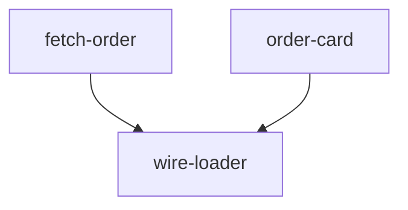

# Lego Plan

Turn a settled change into a **layered DAG** from simple primitives to a working feature. Plan only. Then stop.

The graph is a pyramid: independent blocks at the bottom, composed blocks above, one finish node. A later driver can run same-layer nodes in parallel, flip `status`, and redraw this graph. This skill does not dispatch subagents. It does not load other skills.

## When To Use

Load when the job is to turn a **settled change** into an implementation map the driver can follow.

- **Need:** what to build is already chosen. If a files-to-touch list or path pick is already in this conversation, use it. If not, work from the settled intent and the code. Do not invent a second system map.
- **Skip:** typos, comments, formatting, docs with no code.
- **If intent is still open:** stop. Ask until the change is settled. Do not stack blocks for a feature that is not chosen.

One node is still a DAG. Emit the full contract.

## Hard Gates

1. **Plan only.** Do not write production code. Do not write tests. Name the check in `done when`. Do not implement it here.
2. **Stop after emit.** Chat DAG plus the scratch file. Do not dispatch. Do not load the next skill.
3. **No cycles.** If a block depends on a later block, the split is wrong. Split again.
4. **Do not wait for approval.** Show the DAG and stop. The user interrupts if it is wrong.
5. **Do not open the scratch file** for the user. Do not write a plan under `docs/`.

## Node grain

**Graph node (parallel unit):** one independently shippable primitive a subagent can own without waiting on another *in-progress* node.

Examples: `write fetchOrder`, `write OrderCard`, `wire fetchOrder into the loader`.

Too big: `implement auth`. Split it. Too small: `rename a variable`. Fold it into the node that needs it.

**Parts (inside a node):** the functions that must land **together** so that node compiles. One subagent does parts **in order**. Do not fan out parts.

Example node `fetch-order`:

- `files`: `src/fetchOrder.ts`, `src/fetchOrder.test.ts`
- `parts`: `Order` type, then `fetchOrder`, then write or extend `src/fetchOrder.test.ts`
- those parts are not separate graph nodes

## Graph shape

- **Layer 0:** nodes with `depends on: none`. The driver can run all of them in parallel.
- **Layer N:** nodes whose deps are all in earlier layers.
- **Last layer:** one node (or a tight set) that means the feature works end to end.
- Two nodes that do not depend on each other **must** share a layer (or sit in layers that do not wait on each other).
- `depends on` lists **node ids**, never file names.

**Same file:** if two nodes **create or edit** the same path, they must not share a layer. Merge them, or add a `depends on` edge so one waits. Do not split a file only to run in parallel. Two nodes that only read a path can share a layer. `files` lists create-or-edit paths only. The same-file rule includes test files.

## Node fields

Every node has all seven:

1. **id:** kebab-case, unique in this plan, stable (a later driver marks this id done).
2. **name:** short English name.
3. **depends on:** other ids, or `none`.
4. **files:** create or edit (paths). Include the test path from `done when`.
5. **parts:** ordered C list. **Last part** is write or extend that test. If `done when` is a manual check and there is no test file, the last part is that check and `files` has no test path.
6. **done when:** a test file or command the driver can run before starting dependents.
7. **status:** this skill always writes `pending`. A later driver can set `in-progress` or `done`. This skill never writes those two.

Do not put full source in the plan.

## Live board

Path: `<repo>/.agent/scratch/lego-plan.json`

Same JSON as the chat fence. Agents follow this file. The user-facing product is the chat picture.

- Create `.agent/scratch/` if needed.
- Always overwrite. Do not ask, even if existing nodes are `in-progress` or `done`.
- If the repo has git, make sure `.gitignore` contains `.agent/scratch/`. If `.gitignore` exists and the line is missing, append it. If `.gitignore` is missing, create it with that one line.
- Do not open the file. Do not dump it as a second copy in chat. The JSON fence is the copy the user sees.

## Procedures

### Procedure 1: Confirm a settled change

1. If the change is clear, continue.
2. If the user is still choosing what they want, stop. Ask. Return here after it is settled.

### Procedure 2: Collect inputs already in session

1. If this conversation already has a finish-line file list, parts, or a path pick, use those as the starting set.
2. If not, derive blocks from the settled intent and the code you must read to name files. Do not tour the whole repo.

### Procedure 3: Split into nodes and parts

1. List candidate primitives (B grain).
2. For each primitive, list the C-parts that must compile together. End with write or extend the test (or the manual check).
3. Draw `depends on`: a node depends on another only if it **calls or embeds** the result of that node.
4. Assign layers from the deps. Independent nodes → same layer.
5. If two nodes create or edit the same path and share a layer, merge them or add an edge. Then re-layer.
6. If a cycle appears, split the wrong node and repeat this procedure.

### Procedure 4: Fill each node

Fill the seven fields. `status` is `pending` on every node.

### Procedure 5: Show the DAG in chat

Show, in this order:

1. **Layers:** layer 0 to last. Under each layer, the nodes in that layer.
2. **Nodes:** the seven fields for each id.
3. **Mermaid:** always. One `flowchart` (or `graph TD`). Node ids in the diagram **must match** the plan ids. No `classDef`. No status colors. Every node is pending.
4. **JSON fence:** a `json` block with the live-board object. Source of truth for ids, deps, files, parts, `doneWhen`, and `status`. Layers are derived from `depends`. Do not store a `layer` field.

Then Procedure 6.

Mermaid form:



Same-layer nodes have no edge between them.

JSON form:

```json
{
  "version": 1,
  "nodes": [
    {
      "id": "fetch-order",
      "name": "fetch order",
      "depends": [],
      "files": ["src/fetchOrder.ts", "src/fetchOrder.test.ts"],
      "parts": ["Order type", "fetchOrder", "write or extend src/fetchOrder.test.ts"],
      "doneWhen": "pnpm test src/fetchOrder.test.ts",
      "status": "pending"
    }
  ]
}
```

`depends` is an array of ids. Empty means none.

### Procedure 6: Write the live board

1. Write the same JSON to `.agent/scratch/lego-plan.json` (overwrite).
2. Make sure `.gitignore` ignores `.agent/scratch/` as in Live board.
3. Do not open the file.

### Procedure 7: Stop

After Procedure 6, stop. Do not write code. Do not dispatch. Do not load another skill.

## Decision Tree

- Intent not settled → Procedure 1.
- Settled change, need an implementation map → Procedure 2 → 3 → 4 → 5 → 6 → 7.
- One node → still Procedure 2 → 7 (full contract).
- Typo / format / docs-only → this skill does not apply.
- Cycle in deps → Procedure 3 step 6.
- Same path on two same-layer nodes → Procedure 3 step 5.
- Node is "implement the whole feature" → split (Procedure 3).

## Red Flags

| Signal | What it means | Do instead |
|---|---|---|
| Writing the fetch function in this skill | Plan became implementation | Procedure 7. Stop. |
| One linear list with no layers | Cannot fan out | Put independent nodes in the same layer. |
| Dispatching subagents from here | Leaf became the driver | Procedure 7. Stop. |
| Mermaid ids differ from node ids | Driver cannot mark done | Same kebab-case id in both places. |
| JSON fence differs from the scratch file | Two sources of truth | Write one object. Copy it to both. |
| Cycle (`a → b → a`) | Split is wrong | Split and re-layer. |
| Two same-layer nodes edit `order.ts` | Parallel write clash | Merge or add a `depends on` edge. |
| Splitting a file so two nodes can run in parallel | Unasked design | Keep the file. Sequence the nodes. |
| Test path missing from `files` / last part | Node is not shippable | Procedure 3 step 2. |
| `classDef` or status colors on the plan Mermaid | This skill paints progress | Unstyled. All pending. |
| Parts of one node split into parallel nodes that cannot compile alone | C treated as B | Keep those parts inside one node. |
| "Implement auth" as a single node | Too big | Split into primitives. |
| Waiting for "looks good?" | Gate is show-and-stop | Emit and stop. |
| Asking before overwrite of the scratch file | Live board is one slot | Procedure 6. Overwrite. |
| Opening `.agent/scratch/lego-plan.json` | User-facing extra | Chat only. File is for agents. |
| Writing `docs/lego-plan.md` | Extra artifact | Chat plus scratch. No docs plan file. |

## Error Handling

- **No files-to-touch in session:** derive from intent and targeted reads. If you cannot name files, stop and say what is missing. Do not invent paths.
- **Cycle:** report the cycle by id. Split. Re-run Procedure 3. Do not show a cyclic Mermaid as the plan.
- **Last layer does not mean the feature works:** add a finish node that depends on the composed pieces (the wire-up), or say why the current last layer is already the end-to-end path.
- **User interrupts that a node is wrong:** edit that node and any `depends on` that pointed at it. Keep ids stable if the node still exists. If you drop a node, remove it from the Mermaid and the JSON too. Overwrite the scratch file. Show the DAG again. Stop.
- **`done when` is vague** ("it works"): replace with a command or test path. If the project has no test command yet, name the manual check in one line. Last part is that check.
- **Not a git repo:** still write `.agent/scratch/lego-plan.json` under the workspace if it is writable. Skip the gitignore step. Say that in one line in chat.
- **Scratch write fails** (permissions, disk): still show the chat DAG and JSON fence. Say that the live board was not written. Do not pretend the file exists.
- **Existing scratch JSON is invalid or mid-run:** overwrite. Do not merge. Do not ask.
