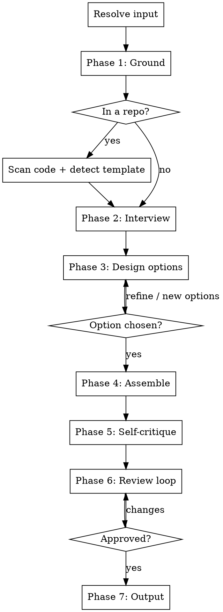

# RFC Writer

Help the user write an RFC that survives review. An RFC is a **forcing function for clarity**, not documentation written after the fact. Its value is the thinking it forces: honest goals, real alternatives, named risks, and a concrete design. A pretty document with hand-waved alternatives and vague goals is worthless. This skill exists to prevent that.

This skill is **interactive by design**. It interviews the user to surface the thinking, grounds every claim in the real codebase, and shows the user working code for the design before writing a word of prose. It never fabricates the hard sections.

## Principles

- **The thinking is the product.** The document is a byproduct. If a section can't be filled honestly (no real alternative exists, no risk is known), say so explicitly rather than inventing filler.
- **Ground every claim.** In a repo, back statements about the current system with file references. Never assert how the code works without having read it.
- **Show, don't tell.** The design is communicated as a worked API / code example the user picked from real options, not as prose. This is non-negotiable (see Phase 3).
- **Rejected options are not waste.** The approaches the user didn't pick become the "Alternatives considered" section, complete with their code. That's why alternatives are real here and not strawmen.
- **Ask only what's unanswered.** If the user's request, a linked ticket, or the code already answers a dimension, don't re-ask it. Confirm your inference instead.
- **Ruthlessly concise.** Every point stated in the fewest words that still make it clear. Prefer bullets over paragraphs, one sentence over three. No preamble, no restating the obvious, no filler. If a section can be one line, it's one line. The code snippet carries the design, so the prose around it stays minimal. A reader should skim the whole RFC in a couple of minutes.
- **No em-dashes** in generated document content. Use commas, colons, periods, or parentheses.

## Process Flow



**Do NOT skip phases.** If the user bundles several answers into one message, accept them and skip ahead past what they answered. Never skip Phase 3 (the user must see and choose the design from real code options) or Phase 5 (self-critique).

## Phase 1: Ground

### Resolve the input

The user may provide: a freeform description, a GitHub PR/issue, a Linear ticket, or just a topic. Extract whatever is already answered so you don't re-ask it in Phase 2.

### If inside a repo (mandatory)

**Scan the code to understand the real context of what the user is proposing.** You cannot write a grounded RFC without knowing the system it changes.

1. **Detect house convention.** Glob for an existing RFC setup: `rfcs/`, `docs/rfcs/`, `docs/rfc/`, `**/*rfc*template*`, `adr/`, `docs/adr/`, `.github/*TEMPLATE*`. If a template file exists, **adopt its section headings and its directory** instead of the built-in template, and tell the user in one line: `Using your repo's docs/rfcs/template.md; overriding my default structure.` No blocking question.
2. **Scan the relevant subsystem.** Read the directory tree (names), README/architecture docs, and the actual modules the proposal touches. Understand: how the affected area works today, the patterns and abstractions already in use, the real constraints (types, interfaces, data flow). This grounds the Background section and, critically, lets Phase 3's code options match existing conventions.
3. **Note file references** you'll cite in the RFC (`path:line`).

If outside a repo: skip scanning and detection; the interview drives a standalone doc using the built-in template.

## Phase 2: Interview

Drive toward the dimensions below. For each, **first check if it's already answered** by the input or the code scan; if so, confirm your inference (`I read that X works via Y - correct?`) instead of asking cold. Ask genuinely-open questions **one at a time**. Where the code scan gives you a candidate answer (especially alternatives and risks), **propose it** so the user reacts rather than generates from scratch.

### Core dimensions (always)

| # | Dimension | Feeds section |
|---|-----------|---------------|
| 1 | **Problem** - what's broken/missing, the pain today | Background / Motivation |
| 2 | **Why now** - trigger, cost of inaction | Motivation |
| 3 | **Goals** - what success looks like, measurable where possible | Goals |
| 4 | **Non-goals** - explicitly out of scope | Non-Goals |
| 5 | **Proposed approach** - handled as design options in Phase 3 | Proposed Design |
| 6 | **Alternatives** - produced for free from Phase 3's rejected options | Alternatives Considered |
| 7 | **Risks / tradeoffs** - what could go wrong, what it costs | Risks & Tradeoffs |
| 8 | **Rollout** - migration, phasing, backward-compat, testing | Rollout Plan |
| 9 | **Approvers / stakeholders** - who decides, who's affected | Approvers |
| 10 | **Open questions** - known unknowns | Open Questions |

### Conditional dimensions (ask only when warranted)

- **Security / privacy** - when the proposal touches auth, secrets, PII, or a trust boundary.
- **Performance / cost** - when it touches a hot path, adds a service, or has a resource budget.
- **Observability** - when it introduces a new service or a failure mode worth alerting on.

Judge relevance from the code scan and the proposal surface. Do not interrogate the user on these by reflex.

### Goal quality check

Push back on vague goals in-interview. "Make it faster" is not a goal; "p99 under 200ms for the tenant list endpoint" is. Ask for the measurable version.

## Phase 3: Design options (the core of the skill)

This is where the RFC earns its keep. **Present 2-3 concrete, distinct approaches to the design, each shown as a worked API / code snippet** grounded in the codebase conventions from Phase 1. Not prose descriptions: actual code showing what the final API, function signatures, schema, or config would look like.

For each option give:

- A short name and one-line summary.
- **A code snippet** of the resulting API / usage / signature (the thing a future engineer would actually write against).
- Its tradeoffs: what it's good at, what it costs, what it rules out.

Present them side by side and ask the user to choose or refine. Iterate if they want a new option or a blend.

**The chosen option becomes the Proposed Design (with its code). The options they reject become the Alternatives Considered section, each keeping its code snippet and the reason it lost.** This is why alternatives in these RFCs are real: they were genuine candidates with working code, not retroactive strawmen.

If only one viable approach genuinely exists, say so and present it alone with an explicit note that alternatives were considered and why none were viable. Do not manufacture fake options to fill the table.

## Phase 4: Assemble

Write the full RFC to the output file (path resolved in Phase 7, confirmed early). **Keep it tight** (see the "Ruthlessly concise" principle): bullets over paragraphs, shortest wording that stays clear, no filler. The code snippet does the explaining; the prose just frames it. Use the repo's house template if one was detected in Phase 1; otherwise the built-in structure below.

Include a **Mermaid diagram** when the design has structure worth seeing (architecture, sequence, data flow, state machine). One diagram answering one question. Skip it for changes that are purely API-level with no interesting flow.

### Built-in template

```markdown
# RFC: <title>

## Summary
<TL;DR a reader gets in 30 seconds: what this proposes and why.>

## Background & Motivation
<The problem, the current state (with file references if in a repo), and why now.
What happens if we do nothing.>

## Goals
<Measurable where possible. Bullets.>

## Non-Goals
<Explicitly out of scope, so reviewers don't relitigate it.>

## Proposed Design
<The chosen approach. Lead with the worked code / API example from Phase 3.
Then explain how it works, grounded in real modules. Diagram if warranted.>

## Alternatives Considered
<Each rejected option from Phase 3, with its code snippet and why it lost.>

## Risks & Tradeoffs
<Each risk paired with a mitigation, or an explicit "accepted, because ...".>

## Rollout Plan
<Migration, phasing, backward-compat, testing strategy.>

## Open Questions
<Known unknowns. Better to name them than pretend they're resolved.>

## Approvers
<Who signs off, who's affected. Names, so it's clear where the decision lies.>
```

Include conditional sections (Security, Performance, Observability) only when they were relevant in Phase 2.

### Optional metadata (only if the user requested it)

By default do not add frontmatter or a number. If the user asks for it, prepend:

```markdown
---
status: Draft   # Draft | In Review | Accepted | Rejected | Superseded
author: <name>
date: <YYYY-MM-DD>
approvers: [ ]
---
```

Auto-number (`NNNN-slug.md`) only if the target directory already contains `NNNN-*.md` files; scan for the highest and increment. Otherwise use a plain slug filename.

## Phase 5: Self-critique (mandatory, before the user sees the draft)

Run the assembled RFC against this rubric and fix what you can. Then report what you caught and what still needs the user.

- **Goals measurable?** Vague aspirations tightened to something testable.
- **Alternatives real?** At least one genuine alternative with its own code, not a strawman. (Phase 3 should guarantee this.)
- **Every risk mitigated?** Each risk has a mitigation or an explicit "accepted, because ...".
- **Design concrete?** The Proposed Design contains an actual API/code snippet, not just prose.
- **Claims backed?** Every statement about the codebase has a file reference behind it. No unbacked assertions.

Report briefly, e.g.: `Self-critique: tightened 2 vague goals; flagged one risk (data migration downtime) with no mitigation yet - need your call. Everything else backed.`

## Phase 6: Review loop

> `RFC written to <path>. Open in a markdown previewer for the rendered diagram. Want any changes?`

Apply changes by editing the file. Loop until approved.

## Phase 7: Output

### Path resolution (confirm early, at the start of Phase 4)

- Repo with detected RFC dir: `<that dir>/<NNNN->slug.md`.
- Repo without one: `docs/rfcs/<slug>.md`.
- Outside a repo: cwd, or the scratchpad if cwd isn't writable.

Ask once up front: `I'll write the RFC to docs/rfcs/<slug>.md. Different location?`

### On completion

- Auto-open for the user in a new VS Code window: `code --new-window "<absolute-path>"`.
- Print a brief terminal summary (title + one-line + path). Do NOT dump the full document to the terminal.

## Error Handling

- **No input / bare topic** - fine, the interview handles it. Start Phase 2.
- **Referenced PR/issue/ticket unreadable** - tell the user, proceed with what they describe.
- **Repo too large to scan fully** - scope the scan to the subsystem the proposal touches; note what you skipped.
- **User can't answer a dimension** - record it as an Open Question rather than inventing an answer.
