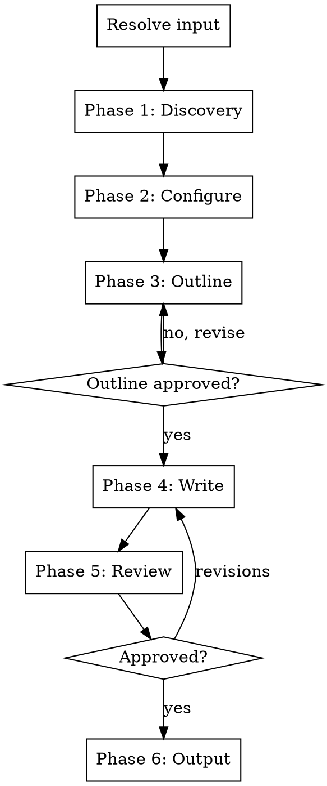

# Video Script Writer

Write video scripts for product demos, feature walkthroughs, and launch videos. Handles pacing, visual directions, timing, and platform-appropriate lengths.

## Input Resolution

Resolve the argument (if provided) in this order:

1. Path to an existing marketing brief (`.md` containing "Executive Summary" or "Key Messages") -> **marketing brief**
2. Path to an existing blog post (`.md` with blog post structure) -> **blog post**
3. Path to an existing changelog -> **changelog**
4. Path to an existing newsletter -> **newsletter**
5. Matches GitHub URL or `#\d+` pattern -> **PR**
6. Contains `...` or `..` -> **git ref range**
7. Resolves to existing file/directory -> **codebase feature**
8. Otherwise -> **freeform text**

If no argument is provided, ask: "What should the video be about? You can provide a marketing brief, blog post, changelog, PR URL/number, git ref range, file/directory path, or just describe the feature."

If multiple interpretations match, confirm with the user.

## Process Flow



**Do NOT skip phases.** Ask questions at a natural pace. If the user answers multiple at once, accept bundled answers and skip ahead.

If the user says "just pick defaults" or similar, pick reasonable defaults, state what you chose, and ask for a single confirmation.

## Phase 1: Discovery

### Step 1 - Analyze the input

| Input type | What to read |
|---|---|
| Marketing brief | Extract problem statement, value prop, audience, key messages. Skip to Step 3. Still do Step 2 if brief lacks product context. |
| Blog post | Extract headline, key points, audience, CTA. Skip to Step 3. |
| Changelog | Extract key entries, focus on the most impactful changes. Skip to Step 3. |
| Newsletter | Extract subject, key updates, CTA. Skip to Step 3. |
| PR | Diff, PR description, review comments, commit messages. For large PRs (20+ files), focus on user-facing changes. |
| Git refs | `git diff` and `git log` between refs. Prioritize user-facing changes. |
| Codebase feature | Read the specified files/directories. |
| Freeform text | Parse the user's description. If it lacks specifics, ask the user to provide more detail or point to a specific file/PR. |

**User-facing changes** include: new features, UI changes, API changes, performance improvements, bug fixes, and documentation updates. **Internal changes** include: refactors, test additions, CI changes, and dependency bumps.

**Error handling:**
- `gh` not available -> inform user, offer alternative input
- Invalid PR/ref -> ask user to verify
- File not found -> ask for correct path

### Step 2 - Read broader product context

Read if they exist: README, docs/, package.json (or equivalent).

If nothing found, ask: "Can you briefly describe the product and who it's for?"

### Step 3 - Present understanding

> "Here's what I'll base the video script on:"
>
> - Feature A - short description
> - Feature B - short description
>
> "Anything to add, remove, or correct?"

Do NOT proceed until the user confirms scope.

### Step 4 - Sensitive content check

Before proceeding, scan for potentially sensitive content: security patches, internal pricing, credentials, unreleased roadmap items, or content marked confidential. Flag anything questionable to the user.

## Phase 2: Configuration

Ask these questions:

**Q1 - Video length:**
- **Short-form (30-90 seconds)** - social media (Reels, Shorts, TikTok)
- **Medium-form (3-5 minutes)** - YouTube, product demos, walkthroughs

**Q2 - Script type:**
- **Voiceover** - narration text read over screen recordings/footage
- **Two-column** - left column: visual directions/screen actions, right column: narration
- **Talking-head** - speaker on camera, conversational delivery

**Q3 - Tone:** Read existing repo content to detect voice. Confirm:

> "Based on your existing content, the tone seems [e.g. conversational and developer-friendly]. Should I match that or go a different direction?"

If no content to analyze, ask directly.

**Q4 - CTA:** Infer from context:
- Open source -> "Star the repo", "Try it out"
- SaaS -> "Sign up free", "Start your trial"
- Feature update -> "Try it now", "Check the docs"

> "I'd suggest the CTA be: [inferred CTA]. Want to go with that or something different?"

## Phase 3: Outline

Generate a structured outline with timing. Use the appropriate template based on video length:

**Short-form (30-90 seconds) - 3-4 sections:**

```
## [Working title] - [total duration]

1. **Hook** (0:00-0:05) - [approach]
   - Key point
   - Visual: [what to show]

2. **Problem** (0:05-0:15) - [pain point to establish]
   - Visual: [what to show]

3. **Solution** (0:15-0:45) - [feature walkthrough]
   - Key point A
   - Visual: [what to show]
   - Key point B
   - Visual: [what to show]

4. **CTA** (0:45-0:60) - [action to take]
   - Visual: [end screen]

Estimated total: ~X words (~Y seconds at 135 WPM)
```

**Medium-form (3-5 minutes) - 5-8 sections:**

```
## [Working title] - [total duration]

1. **Hook** (0:00-0:10) - [approach]
   - Visual: [what to show]

2. **Problem** (0:10-0:30) - [pain point, context, why this matters]
   - Visual: [what to show]

3. **Solution overview** (0:30-1:00) - [high-level what you built]
   - Visual: [what to show]

4. **Deep-dive: [Feature A]** (1:00-2:00) - [walkthrough]
   - Key points
   - Visual: [screen recording steps]

5. **Deep-dive: [Feature B]** (2:00-3:00) - [walkthrough]
   - Key points
   - Visual: [screen recording steps]

6. **Deep-dive: [Feature C]** (3:00-3:45) - [walkthrough]
   - Key points
   - Visual: [screen recording steps]

7. **Recap** (3:45-4:30) - [summarize key benefits]
   - Visual: [summary slide or side-by-side]

8. **CTA** (4:30-5:00) - [action to take]
   - Visual: [end screen]

Estimated total: ~X words (~Y seconds at 135 WPM)
```

Scale the number of deep-dive segments to match the features being covered.

Present the outline and wait for approval before writing.

## Phase 4: Write

### Pacing reference

| Video length | Target words | WPM |
|---|---|---|
| 30 seconds | ~65 words | 130 |
| 60 seconds | ~135 words | 135 |
| 90 seconds | ~200 words | 135 |
| 3 minutes | ~400 words | 135 |
| 5 minutes | ~675 words | 135 |

Target 130-145 WPM for conversational delivery. Flag any section that runs over its allocated time.

### Script format by type

**Voiceover script:**

```
## [Title]

### Hook (0:00-0:05) - ~15 words
VISUAL: [Description of what's on screen]

[Narration text here.]

### Section Name (0:05-0:20) - ~30 words
VISUAL: [Description of what's on screen]

[Narration text here.]
```

**Two-column script:**

```
| Time | Visual | Narration |
|---|---|---|
| 0:00-0:05 | [Screen: landing page loads] | [Narration text] |
| 0:05-0:15 | [Screen: click settings menu] | [Narration text] |
| 0:15-0:30 | [Screen: toggle dark mode] | [Narration text] |
```

**Talking-head script:**

```
## [Title]

### Hook (0:00-0:05) - ~15 words
CAMERA: [Speaker on camera, medium shot]

[Speaker text here. Conversational, direct to camera.]

### Section Name (0:05-0:20) - ~30 words
CAMERA: [Cut to screen recording]
VOICEOVER: [Narration over screen recording]

CAMERA: [Back to speaker]
[Speaker text here.]
```

### Hook

The first 3-5 seconds determine whether viewers keep watching. The hook must:
- Address a pain point or ask a provocative question
- NOT start with your company/product name
- NOT start with "In this video, I'll show you..."
- Create immediate curiosity or emotional resonance

### Visual directions

Always include visual directions inline, regardless of script type:
- `VISUAL:` / `SCREEN:` for screen recordings and footage
- `CAMERA:` for talking-head camera directions
- Be specific: "SCREEN: Click the export button, show PDF downloading" not "SCREEN: Show the feature"
- Include transition notes between scenes

### Timing per section

Include estimated duration and word count for every section:
- `### Section Name (0:15-0:30) - ~30 words`
- Flag if any section exceeds its time budget
- Total script word count must match the target duration at 135 WPM

### Writing rules

- Conversational, not scripted-sounding. Write how people actually talk.
- Short sentences. 10-15 words max per sentence.
- One idea per sentence.
- Active voice always.
- **Never use em-dashes** in the generated content. No "---" characters. Use commas, colons, periods, or parentheses instead.
- Show, don't tell. "Watch how fast this loads" > "It loads very quickly"
- For medium-form videos, use the rule of three: three benefits, three features, three examples. For short-form, focus on a single key benefit.

### CTA

- Last 5-10 seconds of the video
- Single, clear action
- Include visual direction for end screen (subscribe button, link overlay, QR code)

## Phase 5: Review

Present the complete script with timing breakdown:

> "Here's the script:"
>
> [Full script]
>
> **Timing breakdown:**
> - Hook: 5s (~15 words)
> - Problem: 10s (~25 words)
> - Solution: 30s (~70 words)
> - CTA: 10s (~20 words)
> - **Total: 55s (~130 words at 135 WPM)**
>
> "Want any changes?"

Wait for approval. Only proceed to output once the user confirms.

## Phase 6: Output

Always print the final approved script to terminal.

Then ask: "Want me to save this to `scripts/<slug>.md`? Or a different path?"

Create the directory if it doesn't exist. If file already exists, ask whether to overwrite or create a versioned copy.

## Error Handling

- `gh` not available -> inform user, offer alternative input
- Invalid PR/ref -> ask user to verify
- No product context -> ask user to describe the product
- Script exceeds target duration -> flag and suggest cuts before review

## What this skill does NOT do

- Record or edit video
- Generate thumbnails or visual assets
- Create animations or motion graphics
- Write blog posts or social copy (use `/blog-post` or `/social-copy`)
