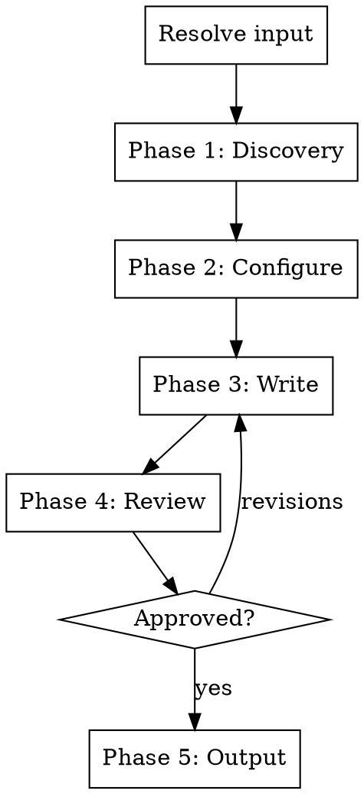

# Social Copy Writer

Generate platform-specific social media copy from code changes, marketing briefs, blog posts, or feature descriptions. Each platform gets copy tailored to its rules, audience behavior, and algorithm.

## Input Resolution

Resolve the argument (if provided) in this order:

1. Path to an existing marketing brief file (`.md` containing "Executive Summary" or "Key Messages") → **marketing brief**
2. Path to an existing blog post file (`.md` with blog post structure) → **blog post**
3. Matches GitHub URL or `#\d+` pattern → **PR**
4. Contains `...` or `..` → **git ref range**
5. Resolves to existing file/directory → **codebase feature**
6. Otherwise → **freeform text**

If no argument is provided, ask: "What should I write social copy for? You can provide a marketing brief, blog post, PR URL/number, git ref range, file/directory path, or just describe the feature."

If multiple interpretations match, confirm with the user.

## Process Flow



**One question per message.** If the user answers multiple questions at once, accept bundled answers and skip ahead. Never assume without confirming.

## Phase 1: Discovery

### Step 1 — Analyze the input

| Input type | What to read |
|---|---|
| Marketing brief | Extract problem statement, value prop, audience, key messages, competitive positioning. Skip to Step 3. Still do Step 2 if brief lacks product context. |
| Blog post | Extract headline, key points, audience, CTA. Skip to Step 3. Still do Step 2 if blog post lacks product context. |
| PR | Diff, PR description, review comments, commit messages (`gh pr view`, `gh pr diff`). Focus on user-facing changes. |
| Git refs | `git diff` and `git log` between refs. Prioritize commit messages and user-facing changes. |
| Codebase feature | Read the specified files/directories. |
| Freeform text | Parse the user's description. |

**Error handling:**
- `gh` not available → inform user, suggest `gh auth login`, offer alternative input
- Invalid PR/ref → ask user to verify
- File not found → ask for correct path

### Step 2 — Read broader product context

Read if they exist: README, docs/, package.json (or equivalent).

If nothing found, ask: "I couldn't find product context in the repo. Can you briefly describe the product and who it's for?"

### Step 3 — Present understanding

> "Here's what I'll base the social copy on:"
>
> - Feature A — short description
> - Feature B — short description
>
> "Anything to add, remove, or correct?"

Do NOT proceed until the user confirms scope.

## Phase 2: Configuration

Ask these one at a time:

**Q1 — Platforms:** "I'll generate copy for Twitter/X and LinkedIn by default. Want to add any other platforms?" (Reddit, Hacker News, Discord, Mastodon, Bluesky, etc.)

If the user adds platforms not covered by existing platform reference files, adapt the copy using your knowledge of that platform's conventions.

**Q2 — Tone:** Read existing repo content (README, docs, blog posts, social links) to detect the product's voice. Then confirm with presets:

> "Based on your existing content, the tone seems [e.g. conversational and developer-focused]. Should I match that, or would you prefer a different direction? Some common options:"
> - Professional/thought-leadership
> - Casual/conversational
> - Witty/playful
> - Technical/precise
> - Founder-voice/authentic

If no existing content to analyze, present the presets directly.

**Q3 — Launch format:** "Do you want a single post per platform or a full launch sequence?"
- **Single post** — one post per platform
- **Launch sequence** — teaser (pre-launch), announcement (launch day), follow-up (post-launch)

**Q4 — CTA:** Infer the most appropriate call to action from context:
- Open source → star the repo, contribute, try it out
- SaaS → sign up, start free trial
- Feature update → try the new feature, read the docs
- Library/SDK → install it, check the docs

> "I'd suggest the CTA be: [inferred CTA]. Want to go with that or something different?"

## Phase 3: Write

Read the platform reference files before writing. Platform rules are in `platforms/` directory alongside this skill file:
- `platforms/twitter-x.md` — Twitter/X rules, format, constraints
- `platforms/linkedin.md` — LinkedIn rules, format, constraints

For any additional platforms the user requested, use your knowledge of that platform's conventions.

### Per-platform generation

For each platform, generate **2-3 variants of the announcement post** with different hook styles. For each variant, note which hook formula it uses (question, bold statement, statistic, narrative, contrarian, etc.).

If the user chose a launch sequence, generate one teaser and one follow-up per platform (no variants needed for those), plus 2-3 variants for the announcement post.

### Writing principles

- **Short by default.** Always strive for the shortest effective copy. Only go longer when the content genuinely demands it.
- **Problem-first.** Lead with why the reader should care, not "We're excited to announce."
- **One CTA per post.** Single, clear, soft.
- **Platform-native.** Each platform's copy should feel like it was written specifically for that platform, not adapted from a template.
- **Character-count aware.** Verify output fits within platform character limits (280 for Twitter/X free tier, 3000 for LinkedIn). If a tweet exceeds 280 chars, trim or restructure — do not deliver over-limit copy.

### Copywriting frameworks

Use these internally to structure the copy — don't label them in the output:

- **PAS** (Problem → Agitate → Solution) — best for empathy-first posts
- **AIDA** (Attention → Interest → Desire → Action) — best for conversion-focused posts
- **HVC** (Hook → Value → CTA) — reliable default structure

### Twitter/X specifics

Follow the format from `platforms/twitter-x.md`:
```
[Hook] [emoji]

[What's new — 1-2 sentences] [emoji]

[CTA] [emoji]
```

No hashtags. 1-2 emojis per section. If content is too rich for a single tweet, generate a thread alternative alongside the single post.

### LinkedIn specifics

Follow the format from `platforms/linkedin.md`. Key rules:
- First 2-3 lines (before "see more" fold) are everything — spend disproportionate effort on the hook
- Short paragraphs (2-3 sentences), generous line breaks
- 1-3 hashtags at the end (topic-relevant, not vanity)
- Restrained emoji use (structural only: ✅ → 📌), 1-3 total per post
- Consider suggesting carousel or video format if content suits it (comparisons, step-by-step, lists) — note these are format recommendations only; the user creates the visual assets separately

### Launch sequence structure (if selected)

For each platform, generate all three phases:

**Teaser (pre-launch):**
- Build curiosity without revealing everything
- Hint at the problem being solved
- "Something big is coming" energy without being vague

**Announcement (launch day):**
- Full reveal — what it is, why it matters, how to try it
- This is the primary post, gets the most effort

**Follow-up (post-launch):**
- Social proof, early results, or deeper dive
- "Here's what people are saying" or "Here's what we learned"
- Keeps momentum going

### Suggested posting schedule

Always include a timing recommendation section:

| Phase | Platform | Suggested timing |
|---|---|---|
| Teaser | All | 2-3 days before launch |
| Announcement | Twitter/X | Tuesday-Thursday, 12-6 PM local |
| Announcement | LinkedIn | Tuesday-Thursday, 10 AM-4 PM local |
| Follow-up | All | 2-3 days after launch |

Adapt timing to the user's audience if known. Note: LinkedIn's golden hour (first 90 minutes) determines 70% of reach — post when the audience is most active.

## Phase 4: Review

Present all generated copy grouped by platform, with variants labeled.

> "Here's the social copy. For each platform I've generated 2-3 variants with different hooks:"
>
> **Twitter/X**
> Variant 1 (bold statement hook): ...
> Variant 2 (question hook): ...
> Variant 3 (statistic hook): ...
>
> **LinkedIn**
> Variant 1: ...
> Variant 2: ...
>
> "Pick your favorites or tell me what to adjust."

Wait for the user to select variants and/or request revisions. Revise only the requested variants — keep others unchanged. Only proceed to output once approved.

## Phase 5: Output

Always print the final approved copy to terminal.

Then ask: "Want me to save this to `social/launch-<slug>.md`? Or a different path?"

Derive the slug from the feature/product name, kebab-cased, max 50 characters, alphanumeric and hyphens only.

If the user confirms:
- Save to the confirmed path, grouped by platform
- Create the directory if it doesn't exist
- If file already exists, ask whether to overwrite or create a versioned copy

## Error Handling

- `gh` not available → inform user, offer alternative input
- Invalid PR/ref → ask user to verify
- No product context → ask user to describe the product
- Platform reference file missing → use your knowledge of the platform's conventions
- No existing blog directory for output → default to `social/`, create it

## What this skill does NOT do

- Write blog posts (use `/blog-post` for that)
- Generate marketing briefs (use `/marketing-brief` for that)
- Schedule or publish posts to any platform
- Create images or video content
- Manage social media accounts
